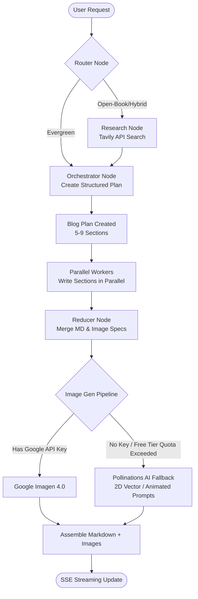

# AI Blog Writing Agent 🚀

An agentic, multi-agent AI writing assistant designed to research, outline, write, and illustrate technical blog posts. Powered by a **LangGraph** orchestration workflow, a **FastAPI** streaming backend, and a modern **Next.js** developer dashboard.

---

## 🏗️ Architecture Workflow

The backend coordinates research, planning, parallel section writing, and image generation using a resilient state graph built with **LangGraph**:



---

## ✨ Key Features & Premium Enhancements

### 1. Agentic Orchestration Workflow (LangGraph)
*   **Case-Insensitive Router Node**: Dynamically determines if a topic is evergreen, open-book, or hybrid, and configures search lookback windows case-insensitively.
*   **Optimized Research Node**: Integrates **Tavily API** to synthesize real-time web articles, normalize dates, and filter evidence by date. Includes search query deduplication to prevent redundant web searches.
*   **Orchestrator Node**: Crafts a detailed blog plan split into 5-9 highly structured tasks.
*   **Parallel Workers**: Writes individual sections concurrently, attaching verified inline Markdown citation links (`[Source](url)`).
*   **Reducer Node**: Merges content, designs image specs, and places images seamlessly.

### 2. Resilient AI Image Generation
*   **Google Imagen 4.0**: Automatically invokes `imagen-4.0-generate-001` for image assets when configured.
*   **Free-Tier Fallback**: Detects API rate limits or resource exhaustion automatically. Falls back to **Pollinations AI** to generate stunning, content-related 2D flat vector/animated illustrations on the fly without requiring an API key.

### 3. Premium Developer Dashboard (Next.js)
*   **Real-time Section Generation Tracker**: A visual checklist showing individual task states (`✓ Completed`, `⚡ Writing...`, or `○ Pending`) and progress bars updating in real time as the agent writes.
*   **Dynamic Card Glows**: Tasks in the Plan tab outline turn green upon completion or pulse purple during generation.
*   **Clean Markdown Rendering**: Renders headers, lists, blockquotes, bold/italic text, and clickable reference source links out of the box.
*   **Interactive Code Blocks**: Code snippets feature syntax coloring (Python, JS, TS, JSON) and an interactive one-click **Copy Code** button.
*   **Export Tools**: Instant one-click **Copy Markdown** clipboard utility alongside download options for raw Markdown files, image bundles, and complete project ZIPs.

---

## 📂 Directory Structure

```text
├── backend/
│   ├── bwa_backend.py      # Core agent graph logic (LangGraph)
│   ├── main.py             # FastAPI SSE streaming server
│   ├── requirements.txt    # Python backend dependencies
│   └── images/             # Generated image directory (Local serving)
├── frontend/
│   ├── src/                # Next.js app sources
│   ├── package.json        # Frontend package configuration
│   └── globals.css         # Custom premium dark theme styling (Amethyst/Amethyst glow)
└── README.md               # Project documentation
```

---

## ⚙️ Setup & Installation

### Prerequisite Environment Variables
Create a `.env` file inside the `backend/` directory:
```env
OPENAI_API_KEY=your_openai_key   # Or GROQ_API_KEY if using Groq
TAVILY_API_KEY=your_tavily_key   # Optional (falls back to closed-book if missing)
GOOGLE_API_KEY=your_google_key   # Optional (falls back to Pollinations AI if missing/free plan)
```

### 1. Run the Backend
```bash
cd backend
python -m venv venv
source venv/bin/activate
pip install -r requirements.txt
python main.py
```
The FastAPI server will start on **`http://localhost:8000`**.

### 2. Run the Frontend
```bash
cd frontend
npm install
npm run dev
```
Open **`http://localhost:3000`** in your browser to start generating.

---

## 🛠️ Troubleshooting

> [!TIP]
> **Port 3000 already in use?**
> If your Next.js server fails to start because port 3000 is locked, run:
> ```bash
> kill -9 $(lsof -t -i:3000)
> ```
> then restart with `npm run dev`.

> [!WARNING]
> **Missing Tavily API Key?**
> The backend will automatically output a warning banner to the frontend event logs:
> `"TAVILY_API_KEY environment variable is not set. Web research will be skipped."`
> The agent will gracefully transition to evergreen mode and write using internal LLM knowledge.

> [!NOTE]
> **Image Generation Failures?**
> Google's free-tier plans often restrict image generation. If the API returns `RESOURCE_EXHAUSTED` or `ClientError`, the application automatically uses Pollinations AI to fetch relevant, beautiful vector art without any user disruption.
