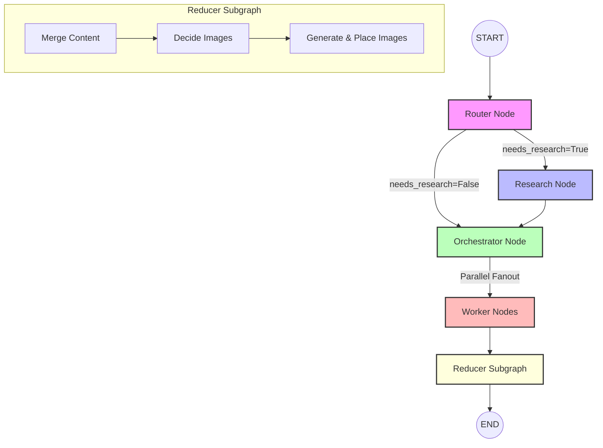

# LLM Blog Writing Agent 🚀

A highly sophisticated, multi-agent AI blog writing system built using **LangGraph**, **FastAPI**, and **Next.js**. The system automates the entire process of research, outlining, parallel section drafting, inline image generation, and bundling.

---

## 🏗️ Architecture Overview

The system uses a **Map-Reduce** pattern orchestrated via a LangGraph state machine. It is designed to work in three modes depending on the topic: `closed_book` (for evergreen topics), `open_book` (for news/recap/roundup), and `hybrid` (for modern tech requiring recent info).



### 🤖 Multi-Agent Workflow
1. **Router Agent**: Analyzes the topic and the `as_of` date to decide if real-time web research is required. If yes, it generates 3–10 targeted search queries.
2. **Research Agent**: Executes concurrent web searches via **Tavily API**, filtering results based on relevance and publication recency.
3. **Orchestrator Agent**: Generates a detailed blog outline/plan (5–9 tasks) containing goals, specific constraints, target word counts, and sub-topics.
4. **Worker Agents**: Concurrently write the sections of the blog post. Workers force citations (Markdown links to search results) for researched claims and output high-quality, targeted content.
5. **Reducer Subgraph**:
   - **Merge Content**: Concatenates all section drafts in order.
   - **Decide Images**: Inspects the post and plans up to 3 contextual images, generating Dall-E / Gemini image prompts and inserting `[[IMAGE_X]]` placeholders.
   - **Generate & Place**: Generates high-quality images using **Gemini-2.5-flash-image**, saves them in the `images/` folder, replaces placeholders, and writes metadata JSON sidecars.

---

## ✨ Features

- **🌐 Live Web Grounding**: Leverages Tavily API to extract up-to-date facts, pricing, and specs, avoiding hallucinations.
- **⚡ Parallel Drafting**: LangGraph maps section writing tasks across multiple concurrent LLM worker invocations for rapid generation.
- **🎨 Automatic Illustration**: Plans and generates custom images/diagrams using Google Gemini Image generation, embedded inline with captions.
- **🔄 Streaming Progress updates**: Server-Sent Events (SSE) API broadcasts real-time node executions and status updates directly to the frontend.
- **📦 Complete Bundling**: Download your blog post as Markdown, or download a full ZIP bundle containing the Markdown file and all generated images.

---

## 🛠️ Tech Stack

### Backend
- **Core Framework**: FastAPI, Uvicorn
- **Agent Orchestration**: LangGraph, LangChain Core, LangChain Community
- **LLM Integrations**: OpenAI API (GPT-4o-mini) or Groq API (Llama-3.1)
- **Web Search**: Tavily API
- **Image Generation**: Google GenAI SDK (Gemini 2.5 Flash Image)
- **Asynchronous Execution**: SSE (Server-Sent Events) via `sse-starlette`

### Frontend
- **Framework**: Next.js 15 (App Router), TypeScript
- **Styling**: Tailwind CSS
- **Features**: Real-time progress tracker, Markdown rendering, side-by-side preview, ZIP downloading, historical logs.

---

## 🚀 Getting Started

### Prerequisites
Make sure you have:
- Python 3.10+
- Node.js 18+

### Setup Environment Variables
Create a `.env` file in the root directory (and optional copies inside `/backend` and `/frontend`):
```env
# LLM Providers (Configure at least one)
OPENAI_API_KEY=your_openai_api_key
# OR
GROQ_API_KEY=your_groq_api_key
GROQ_MODEL=llama-3.1-70b-versatile

# Web Search API
TAVILY_API_KEY=your_tavily_api_key

# Image Generation API
GOOGLE_API_KEY=your_gemini_api_key
```

### Running the Backend

1. Navigate to the `backend` directory:
   ```bash
   cd backend
   ```
2. Create a virtual environment and activate it:
   ```bash
   python3 -m venv venv
   source venv/bin/activate  # On Windows use: venv\Scripts\activate
   ```
3. Install dependencies:
   ```bash
   pip install -r requirements.txt
   ```
4. Start the FastAPI server:
   ```bash
   python3 main.py
   ```
   The backend server will run on `http://localhost:8000`.

### Running the Frontend

1. Navigate to the `frontend` directory:
   ```bash
   cd frontend
   ```
2. Install dependencies:
   ```bash
   npm install
   ```
3. Start the Next.js development server:
   ```bash
   npm run dev
   ```
   Open `http://localhost:3000` in your browser.
