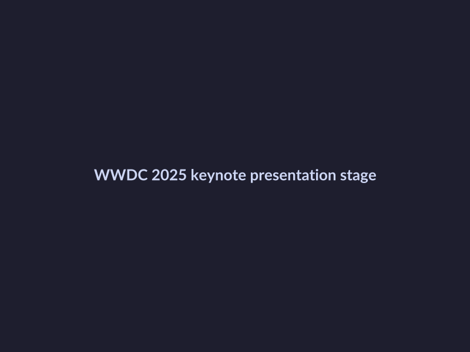
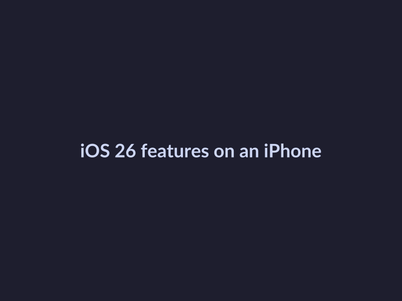

# Apple WWDC 2025: Top Announcements and Updates
## Introduction to WWDC 2025
The [Apple Worldwide Developers Conference (WWDC) 2025](https://www.apple.com/newsroom/2025/05/apples-worldwide-developers-conference-kicks-off-june-9) was a significant event for Apple developers and fans, featuring major announcements and updates. 
* Overview of WWDC 2025: The conference took place on June 9, 2025, and was [live-streamed](https://developer.apple.com/videos/play/wwdc2025/101) for global audiences.
* Major announcements and updates: Notable announcements included [updates to iOS, iPadOS, macOS, VisionOS, tvOS, and watchOS](https://www.cnet.com/tech/services-and-software/everything-announced-at-apple-wwdc-2025-new-ios-ipados-macos-visionos-tvos-watchos-updates), as well as [integrations with OpenAI](https://www.cnbc.com/2025/06/09/apple-wwdc-2025-live-blog.html).
* Importance of WWDC for Apple developers and fans: As [highlighted by various sources](https://ia.acs.org.au/article/2025/apple-s-five-biggest-announcements-from-wwdc-2025.html), WWDC 2025 showcased Apple's commitment to innovation and community engagement, making it a crucial event for those interested in the company's ecosystem.

*Apple WWDC 2025 keynote presentation*
## Liquid Glass Design and Its Features
The Liquid Glass design is a significant announcement from Apple's WWDC 2025 conference, aiming to revolutionize the user interface experience. 
* Introduction to Liquid Glass design: As reported by [CNET](https://www.cnet.com/tech/services-and-software/everything-announced-at-apple-wwdc-2025-new-ios-ipados-macos-visionos-tvos-watchos-updates), Liquid Glass design focuses on providing a seamless and intuitive experience for users.
* Key features and updates: According to [Apple's WWDC 2025 keynote](https://developer.apple.com/videos/play/wwdc2025/101), the new design features enhanced visuals, improved performance, and streamlined navigation. 
* Comparison with previous designs: In comparison to previous designs, Liquid Glass offers a more refined and modern look, as seen in the [WWDC 2025 recap](https://www.youtube.com/watch?v=TWbpwSIMkAE). Overall, the Liquid Glass design is a notable update that enhances the overall user experience, with more information available on [Apple's official website](https://www.apple.com/newsroom/2025/05/apples-worldwide-developers-conference-kicks-off-june-9).
## iOS 26, iPadOS 26, and Other OS Updates
At the WWDC 2025 conference, Apple announced several major updates to its operating systems, including [iOS 26](https://www.cnet.com/tech/services-and-software/everything-announced-at-apple-wwdc-2025-new-ios-ipados-macos-visionos-tvos-watchos-updates) and [iPadOS 26](https://www.cnet.com/tech/services-and-software/everything-announced-at-apple-wwdc-2025-new-ios-ipados-macos-visionos-tvos-watchos-updates). 
* An overview of iOS 26 and iPadOS 26 reveals that these updates bring a range of new features and improvements, including enhanced performance, security, and user experience.
* New features and updates in iOS 26 and iPadOS 26 include improvements to Apple Intelligence, Mac, and other services, as reported by [CNET](https://www.cnet.com/news-live/apple-wwdc-2025-live-keynote-news-annoucements-for-ios-mac) and [CNBC](https://www.cnbc.com/2025/06/09/apple-wwdc-2025-live-blog.html).
* A comparison with previous versions shows that iOS 26 and iPadOS 26 offer significant upgrades, with [Apple's official WWDC 2025 keynote](https://developer.apple.com/videos/play/wwdc2025/101) providing more information on the updates and features. 
For more information on WWDC 2025 announcements, you can check out [Apple's five biggest announcements from WWDC 2025](https://ia.acs.org.au/article/2025/apple-s-five-biggest-announcements-from-wwdc-2025.html) and [WWDC 2025 Recap](https://www.youtube.com/watch?v=TWbpwSIMkAE).

*iOS 26 new features and updates*
## Apple Intelligence and AI Updates
Apple Intelligence is a crucial aspect of Apple's ecosystem, focusing on enhancing user experience through artificial intelligence and machine learning [Source](https://ia.acs.org.au/article/2025/apple-s-five-biggest-announcements-from-wwdc-2025.html). At WWDC 2025, Apple announced several new features and updates to its Apple Intelligence platform, including improvements to its virtual assistant and core ML capabilities [Source](https://www.cnet.com/tech/services-and-software/everything-announced-at-apple-wwdc-2025-new-ios-ipados-macos-visionos-tvos-watchos-updates). The importance of AI in Apple devices cannot be overstated, as it enables features like personalized recommendations, predictive maintenance, and enhanced security [Source](https://www.cnbc.com/2025/06/09/apple-wwdc-2025-live-blog.html). With the integration of OpenAI into the Image Playground app, Apple is further solidifying its commitment to AI-driven innovation [Source](https://www.cnbc.com/2025/06/09/apple-wwdc-2025-live-blog.html). Overall, the updates to Apple Intelligence and AI demonstrate the company's dedication to pushing the boundaries of what is possible with technology.

*Apple AI integrations with OpenAI*
## Conclusion and Future Expectations
The WWDC 2025 conference brought several major announcements, including updates to iOS, iPadOS, macOS, visionOS, tvOS, and watchOS, as outlined in [Apple's five biggest announcements from WWDC 2025](https://ia.acs.org.au/article/2025/apple-s-five-biggest-announcements-from-wwdc-2025.html) and [Everything Announced at Apple WWDC 2025](https://www.cnet.com/tech/services-and-software/everything-announced-at-apple-wwdc-2025-new-ios-ipados-macos-visionos-tvos-watchos-updates). Looking ahead, future expectations and predictions suggest that Apple will continue to innovate and push the boundaries of technology. The importance of WWDC 2025 for Apple and its fans cannot be overstated, as it sets the tone for the company's direction and vision for the future, with [WWDC 2025 Recap](https://www.youtube.com/watch?v=TWbpwSIMkAE) and [WWDC 2025 — June 9](https://www.youtube.com/watch?v=0_DjDdfqtUE) providing valuable insights into the conference's key takeaways.