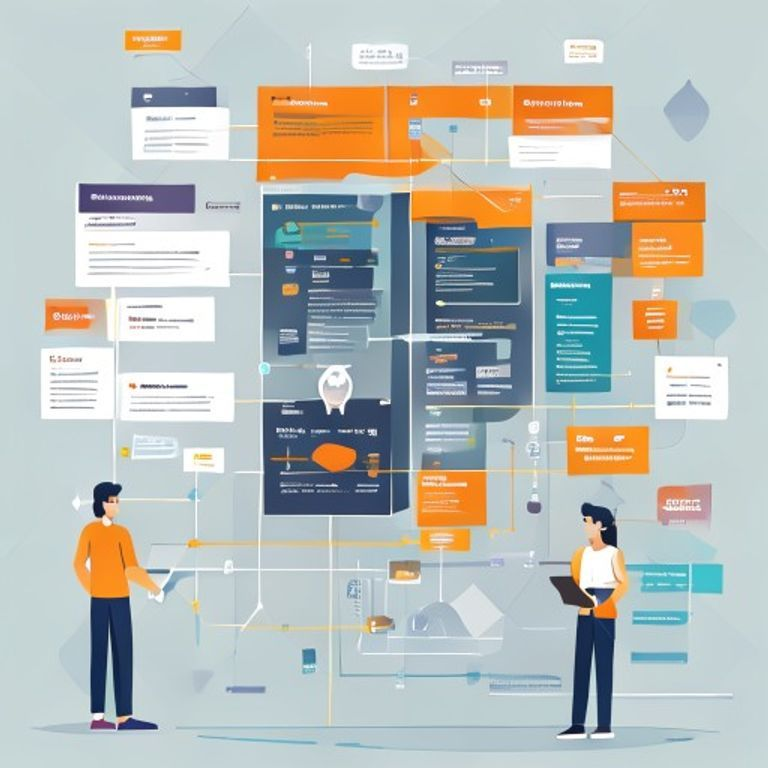
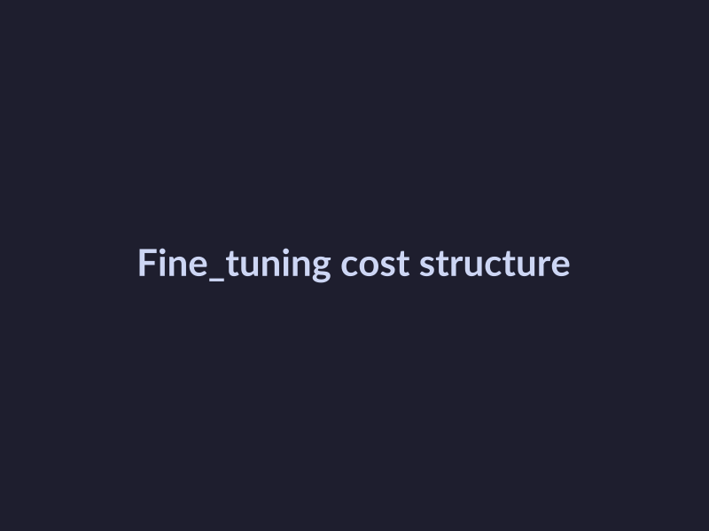
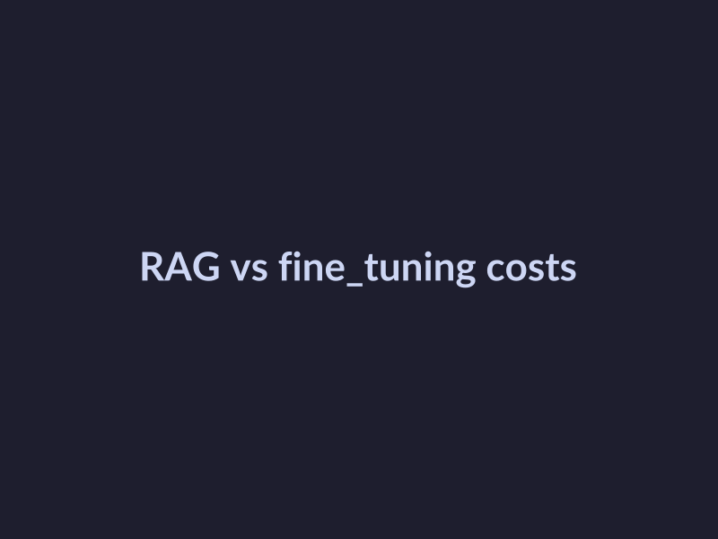

# Cost Comparison Between RAG and Fine-Tuning for Large Language Models
## Introduction to RAG and Fine-Tuning
RAG (Retrieval-Augmented Generation) and fine-tuning are two approaches used to optimize the performance of large language models.
* Define RAG and fine-tuning: RAG involves retrieving relevant information from a database or knowledge graph to augment the generation capabilities of a language model, whereas fine-tuning involves adjusting the model's parameters to fit a specific task or dataset.
* Explain the purpose of each approach: The purpose of RAG is to improve the accuracy and relevance of generated text by incorporating external knowledge, while fine-tuning aims to adapt the model to a specific task or domain.
* Discuss the importance of cost comparison: Understanding the costs associated with each approach is crucial, as it can significantly impact the overall efficiency and scalability of large language model deployments.
## Cost Structure of RAG
The cost structure of Retrieval-Augmented Generation (RAG) is a crucial aspect to consider when deciding between RAG and fine-tuning for large language models.
* Discussing the ongoing retrieval costs, it's essential to note that RAG involves retrieving relevant information from a database or knowledge graph, which can lead to additional costs.
* Explaining the impact of context and retrieval on costs, the context size and retrieval mechanism can significantly affect the overall cost of RAG.
* Providing examples of RAG costs in different scenarios, a study by Elasticsearch Labs found that RAG can be more cost-effective than fine-tuning for certain applications.

*RAG cost structure diagram*
## Cost Structure of Fine-Tuning
The cost structure of fine-tuning large language models (LLMs) is a crucial aspect to consider when deciding between fine-tuning and retrieval-augmented generation (RAG).
* The impact of model size and complexity on costs is significant, as larger and more complex models require more computational resources and memory, resulting in higher costs.
* Examples of fine-tuning costs in different scenarios include: fine-tuning a pre-trained LLM for a specific task, such as sentiment analysis or question-answering.

*Fine-tuning cost structure diagram*
## Comparison of RAG and Fine-Tuning Costs
The cost comparison between Retrieval-Augmented Generation (RAG) and fine-tuning for large language models is a crucial aspect to consider when choosing the right approach for a specific use case.
- Discussing the trade-offs between RAG and fine-tuning, it is essential to consider the advantages and disadvantages of each approach.
* Explaining the scenarios where each approach is more cost-effective, RAG is suitable for applications where the training data is limited, or the model needs to be updated frequently.

*RAG vs fine-tuning cost comparison diagram*
## Case Studies and Examples
The application of RAG and fine-tuning can be seen in different industries, including healthcare, finance, and education.
