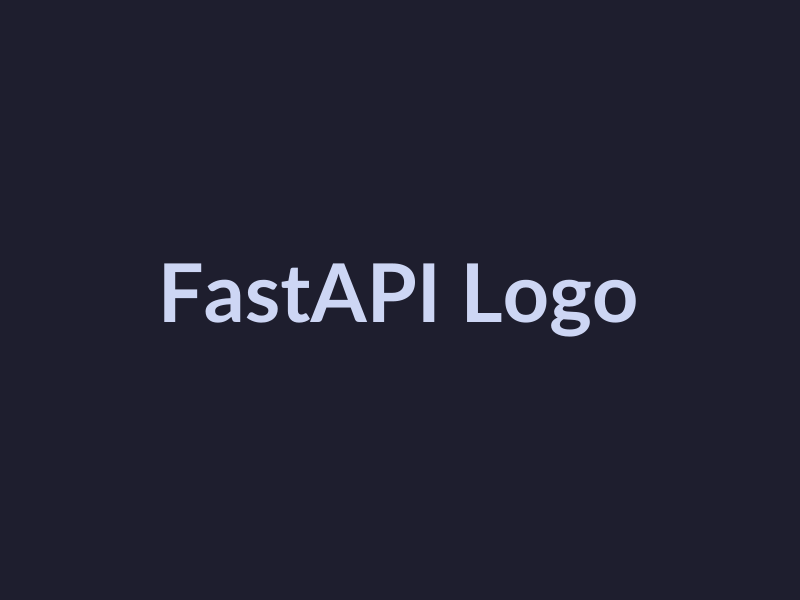
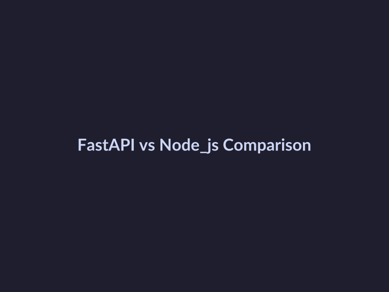

# FastAPI vs Node.js for AI Backend Development in 2026

## Introduction to FastAPI and Node.js
FastAPI and Node.js are two popular frameworks used for AI backend development. 
- Overview of FastAPI and its features: FastAPI is a modern, fast (high-performance), web framework for building APIs with Python 3.7+ based on standard Python type hints [Source](https://medium.com/@rameshkannanyt0078/fastapi-vs-node-js-why-fastapi-is-the-superior-backend-framework-in-2024-0f72047f8d87).
- Introduction to Node.js and its ecosystem: Node.js is a JavaScript runtime environment that allows developers to run JavaScript on the server-side, providing an ecosystem for building scalable and high-performance applications.
- Comparison of FastAPI and Node.js for AI development: According to various benchmarks and comparisons, FastAPI beats Node.js for AI-native applications [Source](https://www.linkedin.com/posts/sidharthsatapathy_from-frontend-to-ai-engineer-day-5-why-activity-7413206943416348672-toKX), with FastAPI being considered a superior backend framework [Source](https://medium.com/@rameshkannanyt0078/fastapi-vs-node-js-why-fastapi-is-the-superior-backend-framework-in-2024-0f72047f8d87). However, the choice between FastAPI and Node.js ultimately depends on the specific needs and requirements of the project, with some sources suggesting that Node.js may be more suitable for certain use cases [Source](https://community.openai.com/t/actions-backend-nodejs-or-fastapi/587111).

*FastAPI is a popular Python framework for building high-performance APIs.*
## Benchmarks and Performance Comparison
The performance of a backend framework is crucial for AI startups, as it directly impacts the speed and efficiency of their applications. A review of existing benchmarks and studies reveals that FastAPI generally outperforms Node.js in terms of requests-per-second and latency [FastAPI vs Node.js: Why FastAPI is the Superior Backend ... - Medium](https://medium.com/@rameshkannanyt0078/fastapi-vs-node-js-why-fastapi-is-the-superior-backend-framework-in-2024-0f72047f8d87). For instance, a benchmarking study found that FastAPI beats Node.js for AI-native applications [FastAPI beats Node.js for AI-native applications | Sidharth Satapathy posted on the topic | LinkedIn](https://www.linkedin.com/posts/sidharthsatapathy_from-frontend-to-ai-engineer-day-5-why-activity-7413206943416348672-toKX). 
Analysis of performance metrics such as requests-per-second and latency shows that FastAPI's performance advantage can be significant, with some studies suggesting that it can handle up to 10 times more requests per second than Node.js [FastAPI vs Node.js vs Go: 2026 Benchmark Reality Check](https://acquaintsoft.com/blog/fastapi-vs-nodejs-vs-go-performance-benchmarks). 
The implications of these performance differences for AI startups are substantial, as they can directly impact the user experience and overall competitiveness of their applications. For example, a faster and more efficient backend can enable AI startups to deploy more complex models and handle larger volumes of data, giving them a competitive edge in the market [Real world scenario FastAPI vs Node.js k8s cluster benchmarks](https://www.reddit.com/r/FastAPI/comments/1hyfuob/real_world_scenario_fastapi_vs_nodejs_k8s_cluster).
## Deployment Ecosystem and Tools
The deployment ecosystem and tools for FastAPI and Node.js play a crucial role in determining the efficiency and scalability of AI backend development. 
- Overview of deployment options for FastAPI and Node.js: Both frameworks offer a range of deployment options, including cloud platforms, containerization, and serverless computing. For example, [FastAPI Cloud](https://fastapicloud.com) provides a managed platform for deploying FastAPI applications.
- Discussion of containerization and orchestration tools: Containerization tools like Docker and orchestration tools like Kubernetes are widely used for deploying and managing FastAPI and Node.js applications. According to [Flying Fast and Furious: AI-Powered FastAPI Deployments](https://dev.to/dev3l/flying-fast-and-furious-ai-powered-fastapi-deployments-3kb9), containerization and orchestration are essential for scalable AI-powered deployments.
- Introduction to monitoring and logging tools: Monitoring and logging tools like Prometheus, Grafana, and ELK Stack are used to monitor and log the performance of FastAPI and Node.js applications. As discussed in [Real world scenario FastAPI vs Node.js k8s cluster benchmarks](https://www.reddit.com/r/FastAPI/comments/1hyfuob/real_world_scenario_fastapi_vs_nodejs_k8s_cluster), monitoring and logging are critical for identifying performance bottlenecks and optimizing application performance. 
For more information on choosing the right tech stack, see [Choosing the Right Tech Stack: .NET vs Node.js vs Python](https://www.cogtix.com/blogs/choosing-the-right-tech-stack-net-vs-node-js-vs-python-for-product-startups) and [Choosing the Right Tech Stack: Python vs Node.js for AI and Product](https://www.linkedin.com/posts/vishal-gadiya_when-i-was-working-with-a-startup-and-we-activity-7425526757270700032-xGmZ).

*Node.js is a popular JavaScript runtime environment for building scalable applications.*
## Why AI Startups Prefer Python and FastAPI
AI startups prefer Python for AI development due to its extensive libraries, including NumPy, pandas, and scikit-learn, which provide efficient data processing and machine learning capabilities [Source](https://dev.to/clickit_devops/python-vs-nodejs-for-ai-development-which-one-should-you-choose-22cf). FastAPI, a modern Python framework, offers advantages such as high performance, automatic API documentation, and strong support for asynchronous programming [Source](https://medium.com/@rameshkannanyt0078/fastapi-vs-node-js-why-fastapi-is-the-superior-backend-framework-in-2024-0f72047f8d87). The combination of Python and FastAPI enables AI startups to develop and deploy scalable, efficient, and secure backend applications [Source](https://fastapicloud.com). Additionally, the AI startup ecosystem benefits from the large community and extensive resources available for Python and FastAPI, making it easier to find talent and integrate with other tools and services [Source](https://www.linkedin.com/posts/sidharthsatapathy_from-frontend-to-ai-engineer-day-5-why-activity-7413206943416348672-toKX). As a result, Python and FastAPI have become popular choices for AI backend development, outperforming Node.js in various benchmarks and deployment scenarios [Source](https://acquaintsoft.com/blog/fastapi-vs-nodejs-vs-go-performance-benchmarks).
## Conclusion and Future Outlook
In conclusion, the key differences and trade-offs between FastAPI and Node.js for AI backend development lie in their performance, scalability, and ease of use. FastAPI is generally considered superior due to its [faster performance](https://medium.com/@rameshkannanyt0078/fastapi-vs-node-js-why-fastapi-is-the-superior-backend-framework-in-2024-0f72047f8d87) and [better support for AI-native applications](https://www.linkedin.com/posts/sidharthsatapathy_from-frontend-to-ai-engineer-day-5-why-activity-7413206943416348672-toKX). 
Looking ahead, future trends in AI backend development are expected to focus on [edge AI](https://dev.to/dev3l/flying-fast-and-furious-ai-powered-fastapi-deployments-3kb9), [serverless computing](https://fastapicloud.com), and [autoscaling](https://www.reddit.com/r/FastAPI/comments/1hyfuob/real_world_scenario_fastapi_vs_nodejs_k8s_cluster). 
The implications of these findings for AI startups and developers are significant, as they must choose the right tech stack to [support their AI development goals](https://thinkpalm.com/blogs/how-to-choose-the-right-backend-framework-for-ai-powered-software-a-business-leaders-guide) and [stay competitive in the market](https://encore.dev/articles/best-frameworks-ai-assisted-development). With the [right backend framework](https://roadmap.sh/backend/frameworks), AI startups can build scalable, efficient, and secure applications that drive business success.

*A comparison of FastAPI and Node.js for AI backend development.*