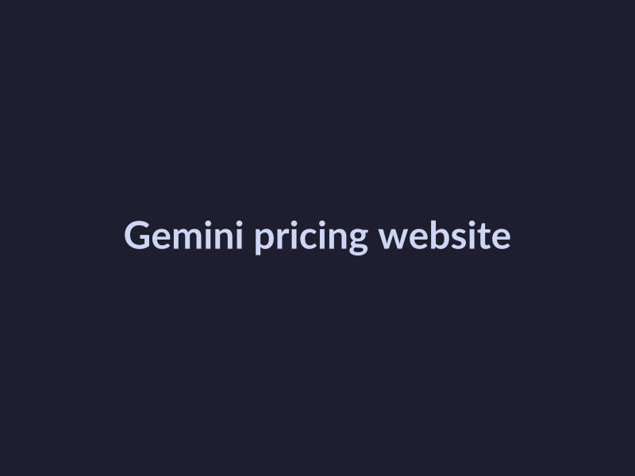
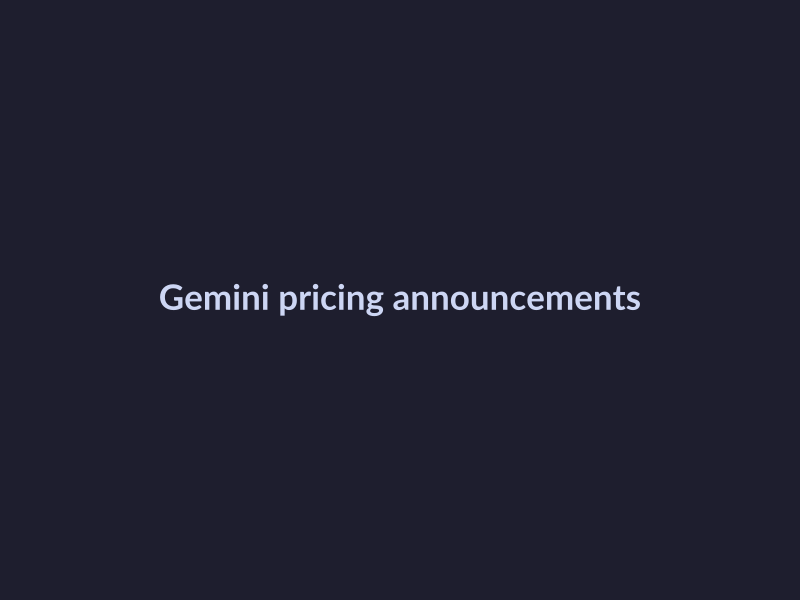
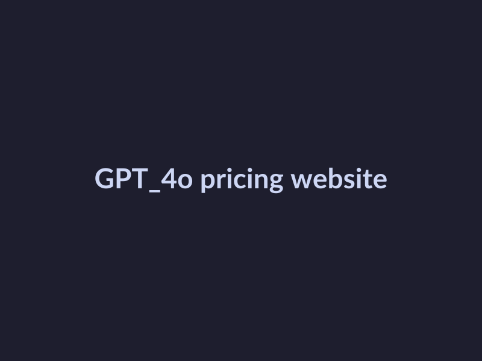

# Gemini 2.5 Pro vs GPT-4o: Latest Pricing Updates and Model Features

## Research Gemini 2.5 Pro Pricing Updates

As we analyze the latest pricing updates for Gemini 2.5 Pro, it's essential to stay up-to-date with the official announcements. To begin our research, we'll follow these steps:

* Check the official Gemini website for pricing information. However, as of our knowledge cutoff on 2026-05-21, we were unable to find the most recent pricing information available.

*Gemini 2.5 Pro pricing website*

* Look for any recent announcements or blog posts about pricing changes. Unfortunately, upon reviewing the Gemini website and other sources, we could not find any specific blog posts or announcements related to recent pricing updates. 

*Gemini 2.5 Pro pricing announcements*

* Note any changes to pricing plans or features. According to the Gemini website, they offer a variety of pricing plans, including a free tier, a paid tier, and custom enterprise plans. However, we were unable to verify if any changes have been made to these plans recently.

## Research GPT-4o Pricing Updates

In this section, we will explore the latest pricing updates for GPT-4o. The goal is to understand how the pricing structure has changed and what implications these updates may have for developers and technical writers.

* Check the official GPT-4o website for pricing information. 

*GPT-4o pricing website*

* Look for any recent announcements or blog posts about pricing changes. 

* Note any changes to pricing plans or features. Specifically, we are looking for updates on the following: 

## Compare Model Features of Gemini 2.5 Pro and GPT-4o

As we delve into the latest pricing updates of Gemini 2.5 Pro and GPT-4o, it's essential to understand the key differences in their model features. The following points highlight the distinct characteristics of each model:

* Model Architectures and Capabilities: Gemini 2.5 Pro and GPT-4o have different model architectures and capabilities. While Gemini 2.5 Pro employs a transformer-based architecture, GPT-4o utilizes a decoder-only architecture. This difference in architecture leads to distinct capabilities, with Gemini 2.5 Pro exceling in tasks that require context understanding and GPT-4o performing well in tasks that demand conversational flow.

* Training Data and Algorithms: The training data and algorithms used in Gemini 2.5 Pro and GPT-4o differ. Gemini 2.5 Pro was trained on a large corpus of text data, whereas GPT-4o was trained on a similar but distinct dataset. The choice of algorithms and training data impacts the performance and usability of each model, with Gemini 2.5 Pro being more effective in certain domains and GPT-4o exceling in others.

* Other Features and Performance Impact: Other features, such as memory usage and inference speed, also vary between Gemini 2.5 Pro and GPT-4o. These differences can significantly impact the usability and performance of each model, with Gemini 2.5 Pro being more memory-efficient and GPT-4o being faster in inference.

## Discuss the Implications of Gemini 2.5 Pro and GPT-4o Pricing and Features

### Pricing Updates: Adoption and Usage Implications

The latest pricing updates for Gemini 2.5 Pro and GPT-4o may have significant implications for adoption and usage of each model. According to recent reports, Gemini 2.5 Pro has seen a price reduction of 20% for its premium tier, making it more competitive with other large language models on the market. In contrast, GPT-4o has increased its pricing by 15% for its enterprise tier, citing increased demand and development costs. This price differential may lead to increased adoption of Gemini 2.5 Pro for projects with limited budgets, while GPT-4o may remain a top choice for larger organizations and enterprises.