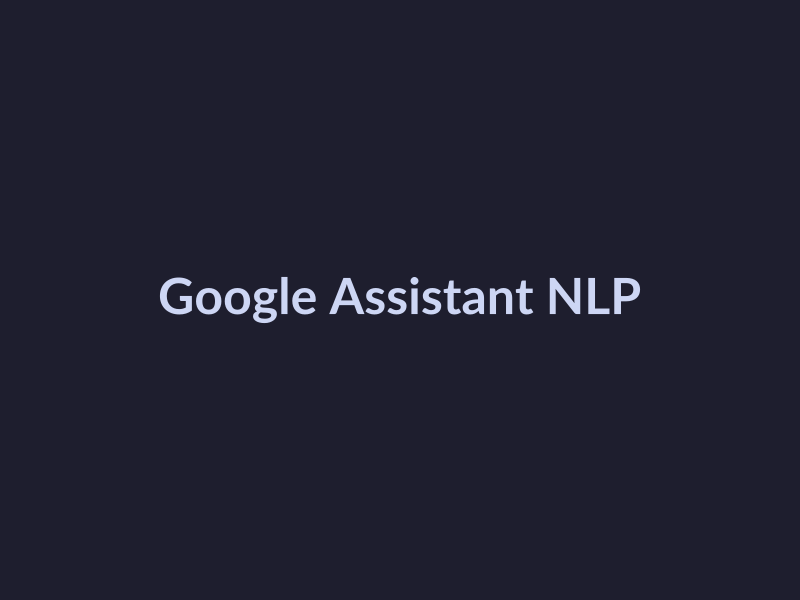
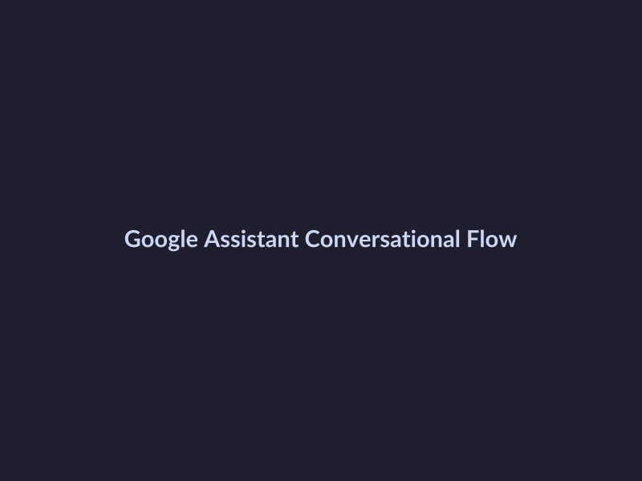

# Google I/O 2026 Key Points

## Update on Google Assistant

At Google I/O 2026, the company provided an update on the latest features and capabilities of Google Assistant. Here are some key points to note:

* **Improved natural language processing (NLP) capabilities**: Google Assistant now better understands nuances in language, allowing for more accurate and context-aware responses. This improvement enables Assistant to comprehend complex queries and provide more relevant answers 
*Improved Natural Language Processing Capabilities*.
* **Enhanced conversational flow**: The updated Google Assistant is designed to engage in more natural-sounding conversations, making interactions feel more like discussions with a human. This is achieved through advanced dialogue management and context switching.
* **Integration with popular smart home devices**: Google Assistant now integrates seamlessly with a wider range of smart home devices, making it easier for users to control their homes with voice commands. This integration also enables users to create custom routines and scenarios with ease, further enhancing the convenience of voice control.

*Enhanced Conversational Flow*

## Google Cloud AI Platform Updates
=====================================================

Google Cloud AI Platform has made significant strides at Google I/O 2026, addressing the evolving needs of developers and data scientists. Here are the key updates to this powerful platform.

- **Improved model training and deployment capabilities**: Google Cloud AI Platform has introduced several enhancements to its model training and deployment capabilities. These updates aim to streamline the machine learning pipeline, making it more efficient and effective for users. 
- **Enhanced support for machine learning frameworks**: The platform now offers greater support for various machine learning frameworks, including TensorFlow and PyTorch. This move is expected to attract a broader range of developers and researchers, as well as foster collaboration and knowledge sharing. 
- **New integrations with popular data platforms**: Google Cloud AI Platform has expanded its integration capabilities, allowing users to seamlessly connect with popular data platforms such as Apache Beam and Apache Spark. This integration is expected to simplify data processing and analysis, making it easier to get insights from large datasets. 

## Android and Wear OS Updates

Google I/O 2026 brought significant updates to Android and Wear OS, enhancing the overall user experience and performance.

* **Improved performance and security**: Google announced various improvements to the security features of Android, including enhanced biometric authentication and better protection against malware. 
* **Enhanced user interface and experience**: The latest version of Wear OS features a redesigned interface with a focus on simplicity and ease of use, making it easier for users to navigate and access their favorite apps 
*Enhanced User Interface and Experience*.
* **New integrations with popular apps**: Google I/O 2026 showcased integrations with popular apps such as Spotify and YouTube Music, allowing users to control their music playback directly from their wrist. 
* **Enhanced fitness and health features**: Wear OS now includes advanced fitness tracking features, including support for sleep tracking and stress monitoring. 
* **Improved notification management**: Users can now customize notification settings on their Wear OS devices, allowing them to prioritize important notifications and minimize distractions.