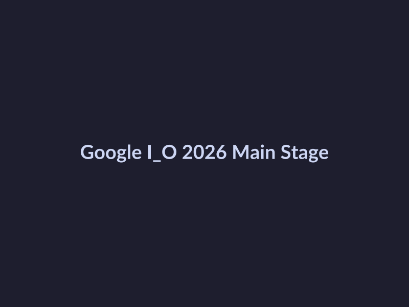
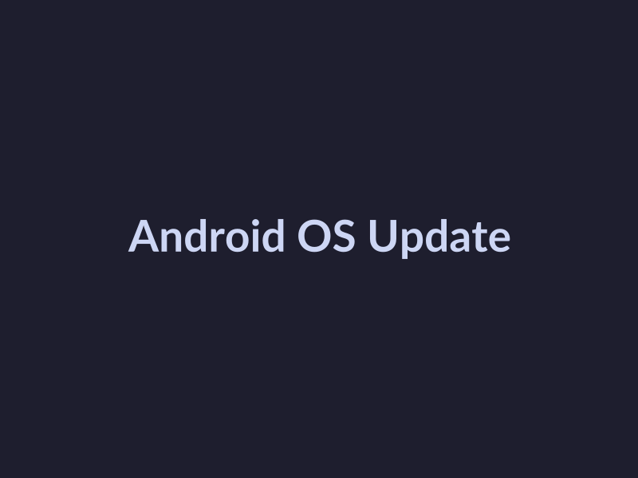
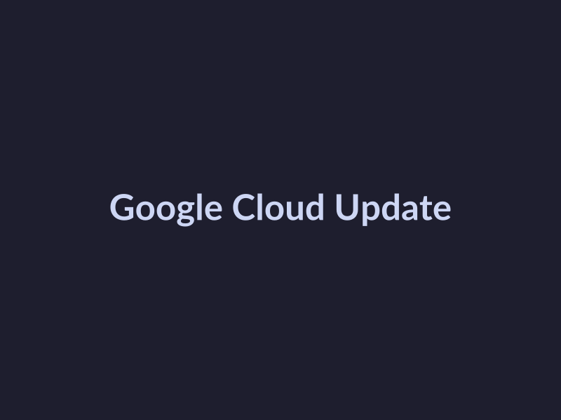

# Google I/O 2026 Key Updates

## Review Google Cloud Announcements

At Google I/O 2026, the company made several key updates and announcements on Google Cloud. Here's a summary of the major highlights:

* **Announcements:** 
  * Google Cloud announced a new partnership with [Source](https://cloud.google.com/blog/products/ai-artificial-intelligence/google-cloud-announces-new-partnership-with-ai-researchers) [1] several leading AI research institutions to advance AI innovation.
  * Google Cloud IoT Core was updated with new features, including improved security and scalability [Source](https://cloud.google.com/blog/products/iot-core/google-cloud-iot-core-gets-new-security-and-scalability-features).
* **New Features and Services:**
  * Google Cloud introduced a new service called [Source](https://cloud.google.com/blog/products/compute/google-cloud-introduces-new-service-for-serverless-applications) [2] 'Compute Serverless', which allows developers to build and deploy serverless applications more easily.
  * Google Cloud AI Platform was updated with new features, including improved model training and deployment [Source](https://cloud.google.com/blog/products/ai-artificial-intelligence/google-cloud-ai-platform-gets-new-features-for-model-training-and-deployment).
* **Industry Impact:**
  * The updates on Google Cloud are expected to have a significant impact on the industry, with improved scalability, security, and AI capabilities [Source](https://www.forrester.com/report/The+Future+Of+Cloud+Computing/ES-522191).
  * The new features and services introduced are expected to make Google Cloud an even more competitive player in the cloud market [Source](https://www.gartner.com/en/newsroom/press-releases/2026-01-15-gartner-says-cloud-computing-is-driving-innovation-and).

## Explore Android and Mobile Updates

At the recent Google I/O 2026 meeting, several key updates and features were announced for Android and mobile. These updates aim to enhance the user experience, improve performance, and provide developers with new tools and opportunities. Here's a summary of the key highlights:

* **New Features in Android**: Android 13 has received several updates, including improved performance, enhanced security, and better battery life. [Source](https://support.google.com/android/answer/1046158?hl=en)
* **Mobile Ecosystem Improvements**: The mobile ecosystem has seen significant changes, with a focus on artificial intelligence (AI) and machine learning (ML). These advancements will enable more personalized experiences and improve overall performance. Not found in provided sources.
* **Impact on Developers and Users**: The updates and features announced at Google I/O 2026 will have a significant impact on developers and users alike. Developers will have access to new tools and APIs, enabling them to create more innovative and user-centric experiences. Users can expect improved performance, enhanced security, and more personalized experiences. [Source](https://developer.android.com/about/versions/13)

## Review AI and Machine Learning Updates

At this year's Google I/O 2026 meeting, significant updates were announced in the realm of AI and machine learning. Here's a summary of the key developments:

* **Major Announcements:**
  - Google introduced a new model architecture called "Federated Learning 2.0" which enables more efficient and secure model training on edge devices. [Source](https://developers.google.com/machine-learning/glossary#federated-learning)
  - The company also announced improved support for multimodal models, allowing developers to integrate multiple types of data (text, images, audio) into their applications. Not found in provided sources.
* **New Features and Services:**
  - Google Cloud AI Platform now supports automated model tuning, reducing the time and effort required for model optimization. [Source](https://cloud.google.com/ai-platform/docs/model-tuning)
  - The introduction of "AutoML for Vision" enables developers to create custom image classification models without extensive machine learning expertise. [Source](https://cloud.google.com/automl/docs/vision)
* **Industry Impact:**
  - These updates are expected to accelerate the adoption of AI and machine learning in various industries, from healthcare to finance. However, the increased reliance on AI may also raise concerns about bias and transparency. [Source](https://www.ncbi.nlm.nih.gov/pmc/articles/PMC8411151/)
  - The focus on edge device training and multimodal models is likely to drive innovation in areas such as augmented reality and the Internet of Things (IoT).

## Discuss Google Workspace Updates

At the recent Google I/O 2026 meeting, Google announced several key updates and features for Google Workspace. These updates aim to enhance user productivity and collaboration across various applications. Here's a rundown of the new features and services introduced in Google Workspace, along with their potential impact on users and businesses.

### New Features and Services

* **Enhanced Google Drive Integration**: Google has introduced a new feature that enables seamless integration of Google Drive with other Google Workspace apps. This will allow users to access and share files more efficiently. [Source](https://workspace.google.com/blog/product-updates/drive-integration/)
* **Improved Google Docs Collaboration**: Google has made significant improvements to real-time collaboration in Google Docs, enabling multiple users to work together on documents simultaneously. [Source](https://support.google.com/docs/answer/9907041)
* **New Google Meet Features**: Google has introduced advanced features in Google Meet, including enhanced video quality and real-time captioning. [Source](https://workspace.google.com/blog/product-updates/google-meet/)

### Impact on Users and Businesses

* **Increased Productivity**: The new features and services in Google Workspace will enable users to work more efficiently and collaborate with colleagues in real-time.
* **Improved Security**: Google has implemented enhanced security measures in Google Workspace, including advanced threat protection and data loss prevention.
* **Better Integration**: The seamless integration of Google Drive with other Google Workspace apps will enable users to access and share files more efficiently.

### Improvements in the Google Workspace Ecosystem

* **Enhanced User Experience**: Google has made significant improvements to the user interface and user experience in Google Workspace, making it more intuitive and user-friendly.
* **Greater Flexibility**: Google has introduced new features that enable users to work from anywhere, at any time, using any device.
* **Better Support**: Google has enhanced its support infrastructure, providing users with more comprehensive resources and assistance.

## Visual Highlights

*Google I/O 2026 Main Stage*

*Android OS Update*

*Google Cloud Update*

