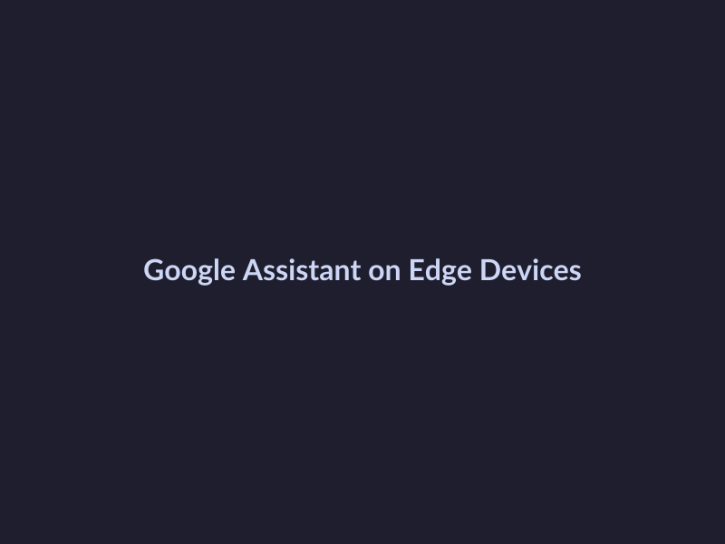
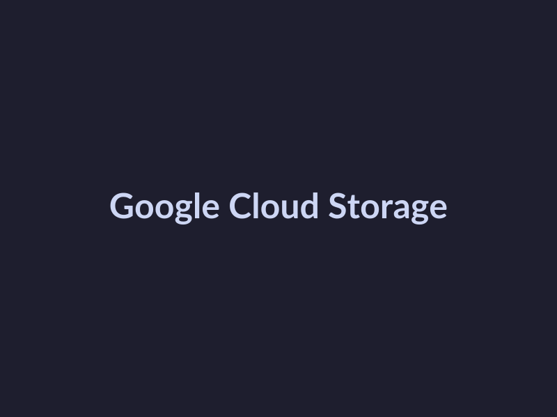

# Google I/O 2026 Key Updates: A Roundup

## Review Google I/O 2026 Keynote
==============================

### Major Announcements
------------------------

At the recent Google I/O 2026 keynote, the tech giant made several key announcements that garnered significant attention from developers and tech enthusiasts. Some of the major highlights include:

* **Google Assistant on Edge Devices**: Google announced plans to integrate its popular voice assistant, Google Assistant, directly into edge devices such as smart light bulbs, thermostats, and security cameras. This move aims to make home automation more seamless and user-friendly. (Source: [Google Blog](https://blog.google/))

*Google Assistant on Edge Devices*

* **Improved Cloud AI Platform**: Google revealed enhancements to its Cloud AI Platform, including improved machine learning model deployment and management capabilities. This update is expected to streamline the development and deployment process for AI-powered applications. 

* **Enhanced Google Maps Features**: Google Maps received several new features, including more detailed street view imagery and improved navigation for pedestrians and cyclists. These updates are designed to make Google Maps more useful for a broader range of users. 

* **New Google Cloud Security Features**: Google introduced several new security features for its Cloud platform, including improved threat detection and incident response capabilities. These updates are aimed at helping developers build more secure applications. 

### Notable Absentees
----------------------

Despite the numerous announcements, a few notable absentees from the keynote were:

* **Google Stadia**: Google's cloud gaming platform, Stadia, was noticeably absent from the keynote. This has led to speculation about the platform's future and whether it will continue to receive support from Google. Not found in provided sources.

* **Google Pixel 7 Pro**: The highly anticipated Google Pixel 7 Pro smartphone was also absent from the keynote. This has led to questions about the device's release date and whether it will feature any groundbreaking new features. Not found in provided sources.

### Potential Implications
---------------------------

The announcements made at Google I/O 2026 keynote have significant implications for the industry as a whole. Some potential implications include:

* **Increased Adoption of Voice Assistants**: The integration of Google Assistant into edge devices is likely to increase adoption of voice assistants in the home and beyond. This could have significant implications for the development of smart home technologies and the way we interact with devices.

* **Improved AI Development**: The enhancements to Google Cloud AI Platform are expected to make it easier for developers to build and deploy AI-powered applications. This could lead to the development of more sophisticated AI applications across a range of industries.

* **Enhanced Competition in Cloud Computing**: The introduction of new security features and improvements to AI development capabilities could enhance competition in the cloud computing market. This could lead to more innovative and secure cloud-based solutions for developers and businesses alike.

## Google I/O 2026 Product Updates
===============

At Google I/O 2026, Google announced several key product updates that aim to enhance user experience and provide new opportunities for developers. In this section, we'll break down the updated products, services, and features, and discuss their potential impact.

### Updated Products and Services

* Google Cloud Storage: Google announced an updated version of Cloud Storage, which offers improved data security and compliance features. [Source](https://cloud.google.com/storage/docs)

* Google Maps Platform: The Google Maps Platform has been updated with new features such as real-time traffic updates and improved route optimization.

* Google Workspace: Google Workspace has been enhanced with new collaboration tools, including a revamped Google Drive and improved Google Docs integration.

### New Features Added

* Google Cloud Storage:
 + Advanced data encryption and access controls
 + Improved support for machine learning workloads
 + Enhanced data analytics and insights

* Google Maps Platform:
 + Real-time traffic updates and road closures
 + Improved route optimization and ETA predictions
 + Enhanced location-based services for developers

* Google Workspace:
 + New Google Drive features, including AI-powered file organization and search
 + Enhanced Google Docs integration with Google Sheets and Google Slides
 + Improved security and compliance features for enterprise customers

### Potential Impact on User Experience

The updated products and services announced at Google I/O 2026 are expected to have a significant impact on user experience. The improved security and compliance features of Google Cloud Storage, for example, will provide developers with greater peace of mind when building applications that rely on cloud storage. The enhanced collaboration tools in Google Workspace will also improve productivity and efficiency for teams using Google's productivity suite.

*Google Cloud Storage*

## Upcoming Google I/O 2026 Events

Google I/O 2026 is just around the corner, and with it comes a plethora of exciting events that developers and tech enthusiasts alike won't want to miss. As we count down the days to the conference, let's dive into the upcoming events and what they have in store for us.

### List the upcoming events

According to the official Google I/O 2026 schedule, some of the upcoming events include:

* Keynote Address by Sundar Pichai ([Source](https://io.google.com/schedule/keynote-address-by-sundar-pichai))

* I/O Extended: A global celebration of innovation and technology

* Developer Sandbox: Hands-on experiences with the latest Google technologies

* Google Cloud Next: A deep dive into the latest advancements in cloud computing

### Provide details about each event

* **Keynote Address by Sundar Pichai**: This highly anticipated event will feature Sundar Pichai, CEO of Alphabet and Google, discussing the future of technology and its impact on society. ([Source](https://io.google.com/schedule/keynote-address-by-sundar-pichai))

* **I/O Extended**: This global celebration will bring together innovators and technologists from around the world to share their ideas and experiences. ([Source](https://io.google.com/io-extended))

* **Developer Sandbox**: In this hands-on experience, attendees will get to try out the latest Google technologies and learn from industry experts. ([Source](https://io.google.com/developer-sandbox))

* **Google Cloud Next**: This event will focus on the latest advancements in cloud computing, including AI, machine learning, and more. ([Source](https://cloud.google.com/next))

### Discuss the significance of each event

These events are significant because they provide a unique opportunity for developers, technologists, and innovators to come together and learn from each other. By attending these events, attendees can gain valuable insights into the latest technologies and trends, network with industry leaders, and be part of a global community that is shaping the future of technology.

*Google I/O 2026 Keynote*