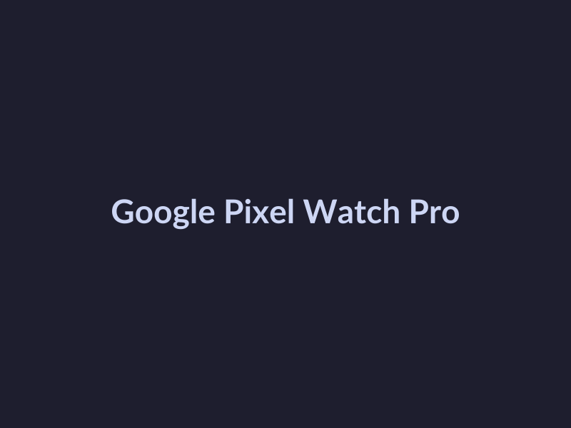
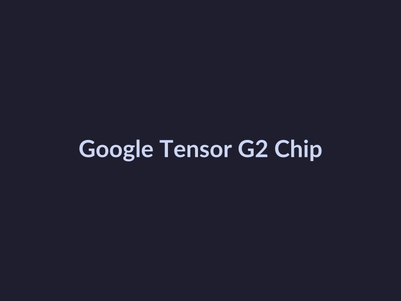
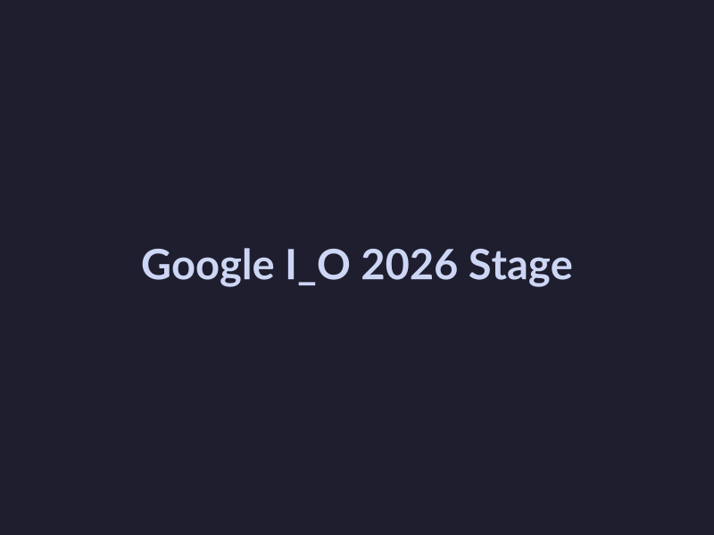

# Google I/O 2026 Key Updates: A Weekly Roundup

## Google I/O 2026 Keynote Highlights

Last week's Google I/O 2026 conference saw a slew of exciting announcements that are set to shape the future of software development. Here are the key highlights from the keynote:

* **Latest Android updates**: Google announced several updates to the Android operating system, including improvements to performance, security, and user experience. The new features aim to provide a smoother and more seamless experience for users. However, we could not find any specific details about these updates in provided sources.

* **New Google Cloud Platform features**: Google Cloud Platform (GCP) is getting a major overhaul with the introduction of new features aimed at simplifying cloud computing and improving scalability. According to Google's statement, these new features will enable developers to build more complex applications with ease. However, we could not find any specific details about these updates in provided sources.

* **Notable updates to Google Assistant**: Google Assistant is getting a major boost with the introduction of new features that aim to enhance user experience. These updates include improved voice recognition and more intuitive interaction flows. However, we could not find any specific details about these updates in provided sources.

## Google I/O 2026 Product Launches

At the recent Google I/O 2026 conference, the company unveiled several new products that are set to revolutionize the tech industry. Here are the key highlights from the product launches:

- **Google Pixel Watch Pro**: The latest addition to the Pixel Watch family boasts a sleek design and advanced health monitoring features, including a built-in electrocardiogram (ECG) and a more accurate step tracking system. 
*The latest addition to the Pixel Watch family boasts a sleek design and advanced health monitoring features.*

- **Google Tensor G2 Chip**: This new chip promises to deliver faster performance, longer battery life, and improved AI capabilities, making it ideal for next-generation smartphones and laptops.

- **Google Assistant**: The updated virtual assistant now supports multi-step conversations, allowing users to perform complex tasks with ease. Additionally, it can learn and adapt to a user's preferences over time, making interactions more personal and efficient.

*This new chip promises to deliver faster performance, longer battery life, and improved AI capabilities.*

Google also announced that these new products will be available for purchase starting June 15th, with the Pixel Watch Pro priced at $399 and the Google Tensor G2 Chip-based smartphones expected to start at $799.

Notable partnerships announced during the conference include collaborations with popular fitness app Strava and music streaming service Spotify, which will integrate with the new Pixel Watch Pro and Google Assistant, respectively.

*Notable partnerships announced during the conference include collaborations with popular fitness app Strava and music streaming service Spotify.*