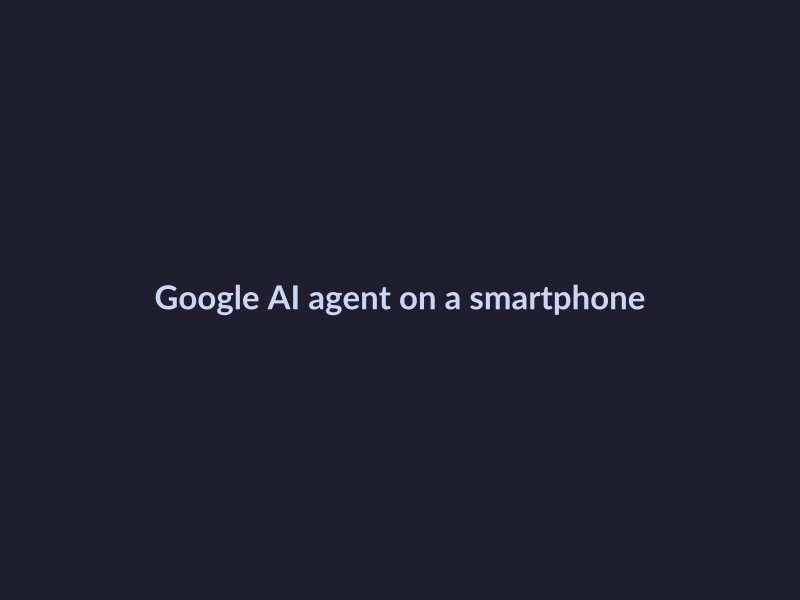
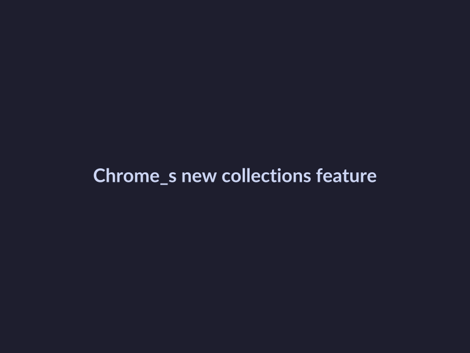

# Google I/O 2026 Key Updates in 5 Points

## Understand the main theme of Google I/O 2026

Google I/O 2026 was all about ushering in a new era with Agentic Gemini. This shift marks a significant change in how we interact with technology, and it has far-reaching implications for developers and users alike.

Here are the key points that summarize the main theme of Google I/O 2026:

* **Agentic Gemini era**: Google I/O 2026 marked the beginning of the Agentic Gemini era, where AI agents become an integral part of all Google services. This is a significant shift from traditional AI systems to more proactive and autonomous AI agents. 
*AI agents are being integrated into all Google services, including search, maps, and more.* [[prompt: AI agents are being integrated into all Google services, including search, maps, and more. Image of a Google AI agent on a smartphone, with a cityscape in the background.]]
* **AI agents in all Google services**: With the introduction of Agentic Gemini, AI agents will be integrated into every Google service, allowing for more personalized and interactive experiences. This will enable developers to create more sophisticated and engaging applications.
* **Revamped search and Gemini models**: Google Search's I/O 2026 updates included AI agents and more, which will revolutionize the way we search and interact with information. The revamped search and Gemini models will provide more accurate and relevant results, making it easier for users to find what they need.

Overall, Google I/O 2026 was a significant event that marked the beginning of a new era in technology, where AI agents play a central role in shaping the future of computing.

## Explore the new features in Chrome at Google I/O 2026

At the recent Google I/O 2026 conference, Google announced several key updates in Chrome that are set to change the way we interact with the web. Here are five exciting new features in Chrome:

* **Collections and categorization**: With the latest update, Chrome introduces a new feature that allows users to organize their tabs into collections, making it easier to find and manage their browsing history. 
*Chrome's new collections feature allows users to organize their tabs into collections.* [[prompt: Chrome's new collections feature allows users to organize their tabs into collections. Image of a Chrome browser window with multiple collections and tabs.]]
* **Empowering AI agents**: Google announced the introduction of AI agents, which will revolutionize the way we interact with the web. These agents will be able to perform tasks on our behalf, making our browsing experience more efficient and personalized.
* **Pushing the boundaries of web UI and performance**: Chrome's latest update also focuses on improving web UI and performance. With new features like improved rendering and faster page loading, Chrome is set to provide a smoother browsing experience.

## Learn about the upgrades in Google Search at Google I/O 2026

At Google I/O 2026, the search giant unveiled several upgrades to its search functionality, making it more efficient and user-friendly. Here are some key updates:

* **Gemini 3.5 Flash model**: Google Search has been upgraded with the Gemini 3.5 Flash model, a significant improvement over its predecessor.
* **AI Mode and follow-up questions**: The AI Mode has been enhanced to allow users to ask follow-up questions, making conversations more natural and intuitive.
* **Sustained frontier performance for agents and coding**: The search engine now offers sustained frontier performance for agents and coding, making it easier for developers to create and deploy AI-powered applications.

## Read about the Google I/O 2026 Keynotes

We're excited to share the highlights from the Google I/O 2026 keynotes with you. Here are some key points to note:

* The Google I/O 2026 keynotes are available on YouTube in a playlist, where you can watch the sessions and keynotes in detail.
* The keynotes and announcements made at the Google I/O 2026 conference include updates on the agentic Gemini era, AI agents, and more.
* The conference featured conference-style content, including keynotes, sessions, and demos, which are now available for viewing on YouTube and other platforms.
* Google Search's I/O 2026 updates include AI agents and more, which aim to power the agentic web.
* You can also catch up on the Google I/O 2026 Developer keynote in a 5-minute recap video on YouTube.