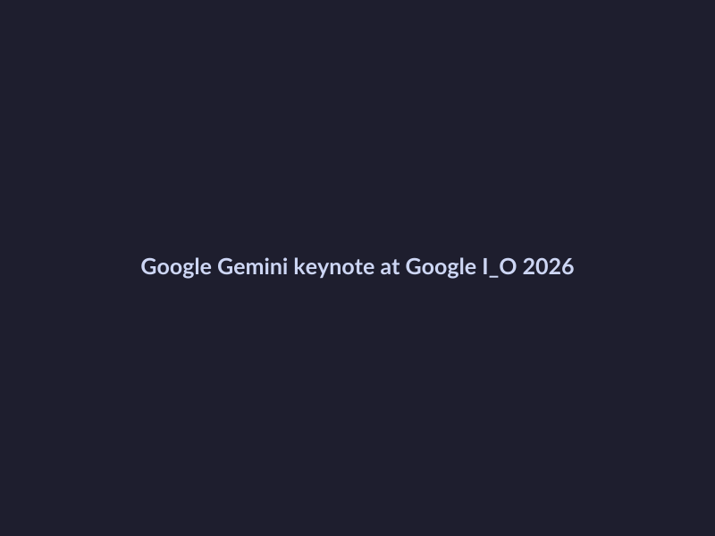
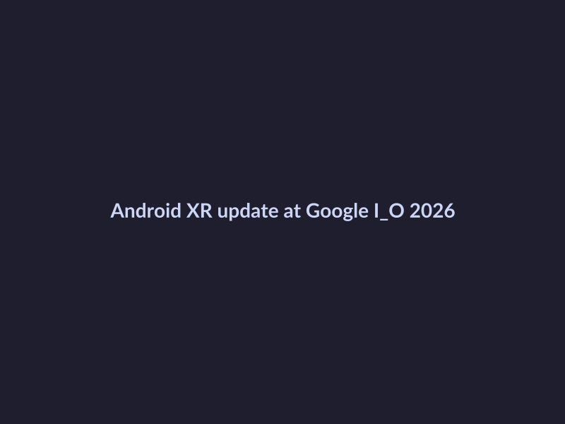
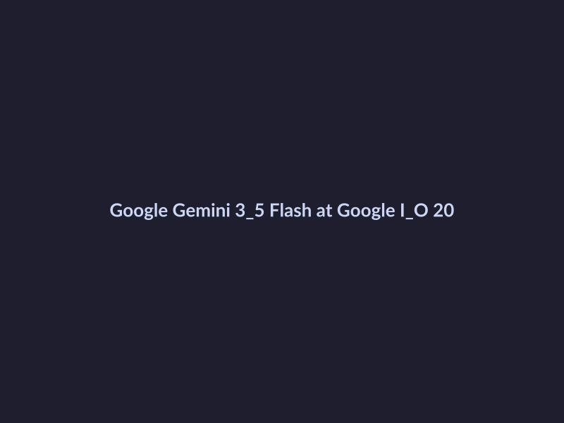

# Google I/O 2026 Keynote Recap: Latest Updates

## Understand the Key Updates from Google I/O 2026
=====================================================

At the recent Google I/O 2026 keynote, Google unveiled a plethora of exciting updates that are set to revolutionize the way we interact with technology. Here are the key announcements that caught our attention:

* **Google Gemini's new updates**: The latest iteration of Google Gemini has introduced AI agents and the Omni model, a significant advancement in natural language processing. This update is expected to enhance the conversational AI capabilities of Google Gemini, making it more intuitive and user-friendly. ([Source](https://blog.google/innovation-and-ai/sundar-pichai-io-2026))

*Google Gemini's new updates at Google I/O 2026*
* **Android XR updates**: Google has announced several updates to Android XR, including improved augmented reality (AR) capabilities and enhanced device support. This update is expected to further blur the lines between the physical and digital worlds. ([Source](https://www.pcmag.com/news/google-io-2026-live-everything-announced-gemini-omni-search-android-xr))

*Android XR updates at Google I/O 2026*
* **Changes to Google Search**: Google has introduced AI-powered agents to Google Search, revolutionizing the way we navigate the internet. This update is expected to provide more accurate and personalized search results. ([Source](https://blog.google/products-and-platforms/products/search/search-io-2026))

These updates showcase Google's commitment to innovation and its vision for a more connected and intelligent future. As we continue to explore the implications of these announcements, one thing is certain – Google I/O 2026 has left us with a lot to look forward to.

## Learn About Google Gemini's New Features
At the recent Google I/O 2026 keynote, Google Gemini received significant attention for its new features and updates. Here are the key updates to know:

* **AI agents and Omni model**: Google Gemini has been upgraded to incorporate more advanced AI agents and the Omni model, a key component of Google's search technology. This integration is expected to improve the accuracy and efficiency of Gemini's search results. [Source](https://blog.google/products-and-platforms/products/search/search-io-2026)

*Google Gemini 3.5 Flash at Google I/O 2026*
* **Gemini 3.5 Flash**: Google Gemini 3.5 Flash was announced, bringing improved performance and speed to the platform. This update aims to enhance the overall user experience and make Gemini more robust. [Source](https://blog.google/innovation-and-ai/technology/ai/google-io-2026-all-our-announcements)
* **New usage limits and storage options**: Google has introduced new usage limits and storage options for Gemini, allowing developers to better manage their resources and scale their applications. This update is designed to make it easier for developers to build and deploy Gemini-powered applications. [Source](https://io.google)

## Explore the Changes to Google Search

At Google I/O 2026, Google announced some exciting updates to Google Search, including the integration of AI-powered agents. These changes aim to make Search more personalized and efficient.

### Key Updates

* **AI-powered agents for Search**: Google is introducing AI-powered agents to help users navigate Search results more effectively. These agents will be able to understand natural language queries and provide more accurate and relevant results.
* **New features for Search, including advanced model capabilities**: Google is also introducing new features for Search, such as advanced model capabilities that will enable Search to better understand the context and intent behind a user's query.

According to the Google Blog, "These updates mark an important milestone in the evolution of Search, and we're excited to see how they will change the way users interact with Google." ([Source](https://blog.google/products-and-platforms/products/search/search-io-2026))

As described in the WIRED article, "The agentic Gemini era is here, and it's changing the game for Search." ([Source](https://www.wired.com/story/everything-google-announced-at-google-io-2026))

While we're still learning more about these updates, one thing is clear: Google Search is evolving, and it's going to be exciting to see how these changes impact the way we use the internet.