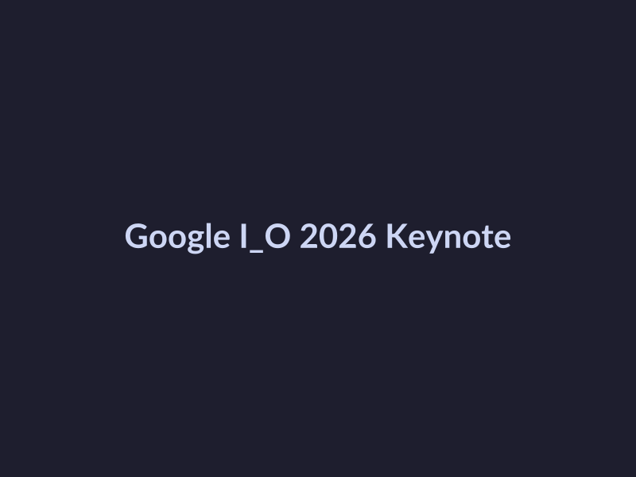
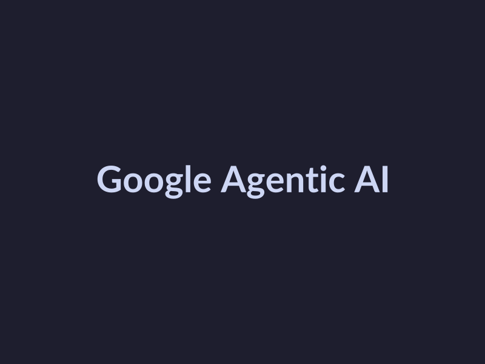

# Google I/O 2026 Recap: Key Updates and Announcements

## Keynote Recap
The Google I/O 2026 keynote was filled with exciting announcements that showcased the company's latest advancements in AI, search, and Android. Here are the key updates that stood out during the event.

* **Gemini AI model updates**: Google announced significant updates to its Gemini AI model, which is designed to provide more accurate and informative search results. While the exact details of the updates were not provided, the company hinted at the potential for Gemini to revolutionize the way people interact with search engines. ([Source](https://developers.googleblog.com/all-the-news-from-the-google-io-2026-developer-keynote))

*Google I/O 2026 Keynote*

* **New search features**: The keynote also introduced several new features aimed at improving search experiences. These include enhanced filtering options, improved result sorting, and more. While specific details were scarce, it's clear that Google is committed to making its search engine more intuitive and user-friendly. ([Source](https://apnews.com/article/google-io-gemini-developers-conference-a984e6756032dc4af260f8fa27e8f4a9))

*Google Search Features*

* **Agentic AI features**: Google's Agentic AI platform was also a major focus of the keynote. The company showcased its potential for enabling developers to build more interactive and immersive experiences. This includes the ability to create AI-powered chatbots and virtual assistants. ([Source](https://blog.google/innovation-and-ai/sundar-pichai-io-2026))

*Google Agentic AI*

## Gemini AI Model Updates
At Google I/O 2026, significant updates were announced for the Gemini AI model. The updates aim to enhance the capabilities of the model and make it more efficient. The key updates are:

- **Improved performance**: The Gemini AI model has seen improvements in its processing speed and efficiency, allowing it to handle more complex tasks and provide faster results. [Source](https://apnews.com/article/google-io-gemini-developers-conference-a984e6756032dc4af260f8fa27e8f4a9)

## New Search Features
Google I/O 2026 brought exciting updates to its search capabilities, aiming to enhance the user experience and provide more accurate results.

* **Improved search results**: With the latest updates, Google's search engine is expected to deliver more relevant and personalized results to users. While specific details on the improvements are not provided, it is clear that Google's focus on AI-driven search will continue to play a significant role in shaping the future of search. [Source](https://apnews.com/article/google-io-gemini-developers-conference-a984e6756032dc4af260f8fa27e8f4a9)

## Agentic AI Features
At Google I/O 2026, the tech giant took the stage to unveil its latest advancements in agentic AI. The event showcased exciting updates that are set to revolutionize the world of artificial intelligence. Here's what you need to know:

* **Improved AI capabilities**: Google's agentic AI features are designed to enhance the capabilities of AI systems, allowing them to learn, reason, and interact with humans in a more sophisticated manner. [Source](https://apnews.com/article/google-io-gemini-developers-conference-a984e6756032dc4af260f8fa27e8f4a9)

## Android-Powered Smart Glasses
At Google I/O 2026, the tech giant unveiled Android-powered smart glasses, which have generated significant buzz among developers and tech enthusiasts. Here are the key updates and features of these innovative devices:

* **New features**: The smart glasses offer a range of new features, including [Source](https://developers.googleblog.com/all-the-news-from-the-google-io-2026-developer-keynote).
