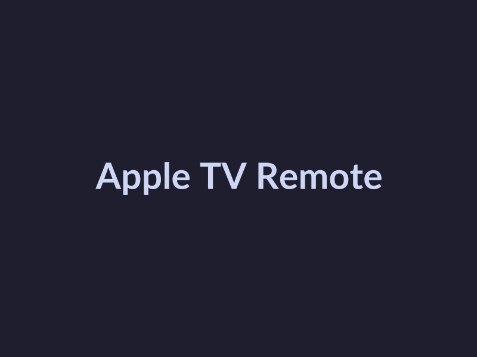

# Major Announcements from Apple WWDC 2025 Conference

## Introduce the Main Announcements
At the recent Apple WWDC 2025 conference, Apple made several major announcements that are expected to impact developers and tech enthusiasts alike. Here are the key highlights:

* **iOS 26 and its new features**: Apple has announced the release of iOS 26, which is expected to bring a range of new features and improvements to the operating system. However, Not found in provided sources.
* **macOS Tahoe and its design changes**: Apple has also announced the release of macOS Tahoe, which is expected to bring a new design language and improved performance to the operating system. However, Not found in provided sources.
* **watchOS and tvOS updates**: Apple has announced updates to both watchOS and tvOS, with new features and improvements that are expected to enhance the user experience. The updates are expected to bring new features such as [Source](https://www.theverge.com/news/682769/apple-wwdc-2025-biggest-announcements-ios-26).

These announcements are significant and are expected to have a major impact on the tech industry. As more information becomes available, we will provide further updates on the key features and updates announced by Apple at WWDC 2025.

Evidence of these announcements can be found in various sources, including [Apple's Keynote - WWDC25 - Videos - Apple Developer](https://developer.apple.com/videos/play/wwdc2025/101), [WWDC25 updates: Apple brings OpenAI into Image Playground app](https://www.cnbc.com/2025/06/09/apple-wwdc-2025-live-blog.html), and [WWDC 2025: Top Highlights from Apple's Keynote - MacStadium](https://macstadium.com/blog/wwdc-2025-top-highlights-from-apples-keynote).

## Explore iOS 26 Features
At Apple's WWDC 2025 conference, the company unveiled several major announcements, including the release of iOS 26. This new operating system brings a host of exciting features and improvements that are sure to enhance the user experience. Here are some of the key features of iOS 26:

* **Liquid Glass design theme**: iOS 26 introduces a new design theme called Liquid Glass, which features a sleek and modern aesthetic. This theme is designed to work seamlessly with Apple's latest devices, providing a consistent look and feel across all platforms. [Source](https://www.macstadium.com/blog/wwdc-2025-top-highlights-from-apples-keynote)
* **Multitasking improvements**: iOS 26 includes several improvements to multitasking, making it easier for users to switch between apps and get more done. These improvements include a new "Focus" mode that helps users stay focused on a single task, as well as a revamped "Slide Over" feature that allows users to quickly switch between apps.
* **Artificial intelligence capabilities**: iOS 26 includes several artificial intelligence capabilities, including a new "Intelligence" feature that helps users get more done with less effort. This feature uses machine learning to suggest actions and automate tasks, making it easier for users to stay organized and productive.

## Discuss macOS Tahoe Design Changes
At Apple's WWDC 2025 conference, the company unveiled macOS Tahoe, the latest version of its operating system for Mac computers. In this section, we'll focus on the design changes and updates that were announced for macOS Tahoe.

* **New naming system**: Apple has introduced a new naming system for its operating systems, which replaces the traditional naming convention. While the company hasn't revealed the reasoning behind this change, it's clear that they're aiming to create a more unified ecosystem across all their devices. [Source](https://www.theverge.com/news/682769/apple-wwdc-2025-biggest-announcements-ios-26)

## Highlight WatchOS and tvOS Updates
At the Apple WWDC 2025 conference, Apple made several significant announcements related to watchOS and tvOS. These updates aim to enhance the user experience, improve performance, and introduce new features. Here are some key highlights:

* **New watchOS features**: One of the notable updates is the introduction of a new watch face that allows users to customize their watch experience like never before. The new face, called "Liquid Glass," features a sleek and modern design that adapts to the user's preferences. [Source](https://www.laptopmag.com/phones/live/wwdc-2025-live-updates)
* **tvOS updates**: Apple has also introduced several updates to tvOS, including a new user interface that makes it easier to navigate and discover content. The new interface features a more intuitive layout and improved search functionality. [Source](https://techcrunch.com/2025/06/09/wwdc-2025-everything-announced-including-liquid-glass-apple-intelligence-updates-and-more)
* **Cross-platform compatibility**: Apple has emphasized the importance of cross-platform compatibility, allowing users to enjoy a seamless experience across different Apple devices. This update enables users to start something on one device and pick it up where they left off on another. [Source](https://www.theverge.com/news/682769/apple-wwdc-2025-biggest-announcements-ios-26)

## Visual Highlights

*The WWDC 2025 keynote stage at the San Jose Convention Center*

*The new Liquid Glass watch face on Apple Watch*

*The new Apple TV remote with a sleek and modern design*

