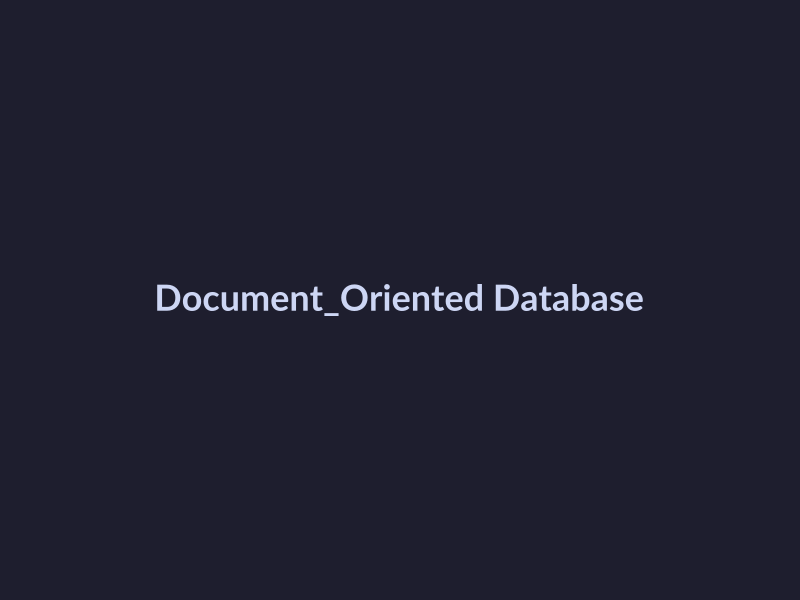
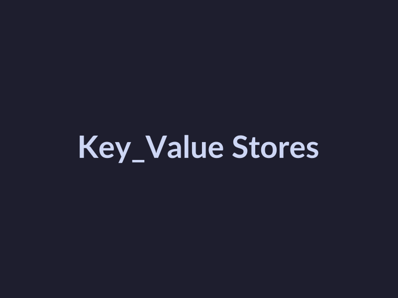
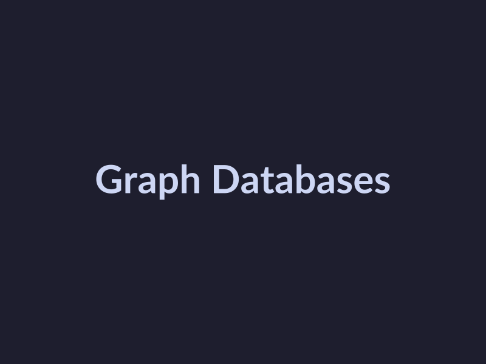

# Modern Software Comparisons Guide

## Choose a Modern Web Framework

When it comes to building a web application, selecting a suitable web framework is a crucial decision that can impact the project's performance, scalability, and maintainability. In this section, we will guide you through the process of choosing a modern web framework, highlighting the differences between popular frameworks and the trade-offs between monolithic and microservices architectures.

*   **Understand the differences between popular web frameworks**: There are several popular web frameworks available, each with its own strengths and weaknesses. Some of the most popular ones include:

    +   React: A JavaScript library for building user interfaces, known for its efficiency and flexibility.
    +   Angular: A TypeScript-based framework for building complex web applications, offering a wide range of features and tools.
    +   Vue.js: A progressive and flexible framework for building web applications, with a strong focus on ease of use and maintainability.

*   **Evaluate the trade-offs between monolithic and microservices architectures**: When choosing a web framework, it's essential to consider the underlying architecture of your application. Monolithic architecture can be simpler to maintain, but may become unwieldy as the application grows. Microservices architecture, on the other hand, can provide greater scalability and flexibility, but may require more complex infrastructure and development processes.

*   **Consider the impact of framework choice on project timelines and budgets**: The choice of web framework can significantly impact the project's timeline and budget. For example, a framework with a steeper learning curve may require more time and resources to implement, while a framework with a more extensive ecosystem may require additional costs for licensing and support.

To make an informed decision, consider the following factors:

*   **Project requirements**: What are the specific needs of your project? Do you require a high degree of customization, or can you work with a more standard framework?
*   **Team expertise**: What is the skill level of your development team? Do they have experience with the chosen framework?
*   **Development speed**: How quickly do you need to deliver the application? Can you afford to invest time in learning a new framework?

Ultimately, the choice of web framework depends on the specific needs of your project and the expertise of your development team. By evaluating these factors and considering the trade-offs between popular frameworks and architectures, you can make an informed decision that meets your project's requirements and budget.

## Compare NoSQL Databases

When selecting a suitable NoSQL database for your project, it's essential to understand the fundamental differences between popular NoSQL databases like MongoDB, Cassandra, and Redis. These databases cater to various data structures, scalability requirements, and performance needs, making each suitable for specific use cases.

### NoSQL Database Fundamentals

*   **Document-Oriented Databases**: MongoDB is a prime example of a document-oriented NoSQL database. It stores data in JSON-like documents, making it easy to work with semi-structured data. 
*A diagram illustrating the architecture of a document-oriented NoSQL database like MongoDB.*

*   **Key-Value Stores**: Redis is a key-value store that allows for efficient storage and retrieval of data. It's ideal for applications that require high-performance caching and real-time data processing. 
*A diagram illustrating the architecture of a key-value store like Redis.*

*   **Graph Databases**: Cassandra is a distributed NoSQL database that supports graph databases. It's designed for handling large amounts of data across many commodity servers, making it suitable for big data and real-time analytics. 
*A diagram illustrating the architecture of a graph database like Cassandra.*

### Evaluating NoSQL Database Trade-Offs

When choosing a NoSQL database, it's crucial to evaluate the trade-offs between data consistency, availability, and performance. Each database has its strengths and weaknesses, and understanding these trade-offs will help you make an informed decision.

*   **Data Consistency**: Document-oriented databases like MongoDB offer strong consistency guarantees, ensuring data is always up-to-date and accurate. In contrast, key-value stores like Redis sacrifice consistency for high availability and performance.
*   **Scalability**: Distributed databases like Cassandra are designed to scale horizontally, handling large amounts of data and traffic with ease. This makes them suitable for big data and real-time analytics applications.
*   **Performance**: Key-value stores like Redis offer exceptional performance, making them ideal for caching and real-time data processing applications.

### Choosing the Right NoSQL Database

Ultimately, the choice of NoSQL database depends on your project's specific requirements, data structure, and scalability needs. By understanding the differences between popular NoSQL databases and evaluating the trade-offs between data consistency, availability, and performance, you'll be well-equipped to select a suitable NoSQL database for your project.

## Evaluate Cloud Service Providers

Selecting a suitable cloud service provider is crucial for the success of your project. In this section, we will guide you through evaluating cloud service providers based on cost, scalability, and reliability.

When choosing a cloud service provider, it's essential to understand the differences between popular options like AWS, Azure, and Google Cloud. While they share some similarities, each has its unique strengths and weaknesses.

### Evaluate IaaS, PaaS, and SaaS Offerings

Before selecting a cloud service provider, you need to evaluate the trade-offs between Infrastructure as a Service (IaaS), Platform as a Service (PaaS), and Software as a Service (SaaS) offerings. Here's a brief overview of each:

*   **IaaS**: Provides virtualized computing resources, allowing you to manage the infrastructure and deploy custom applications. (Source: [AWS IaaS](https://aws.amazon.com/what-is-iaas/))
*   **PaaS**: Offers a fully managed platform for developing, running, and managing applications, without the need for infrastructure management. (Source: [Azure PaaS](https://azure.microsoft.com/en-us/services/app-service/))
*   **SaaS**: Delivers software applications over the internet, eliminating the need for local installation and maintenance. (Source: [Google Cloud SaaS](https://cloud.google.com/solutions/saas))