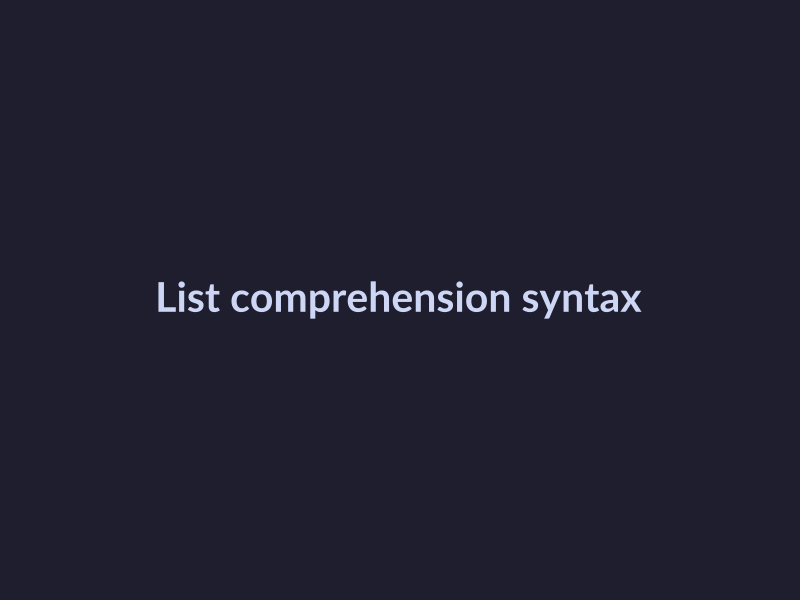

# Python List Comprehensions Quick Guide

## Introduction to List Comprehensions
List comprehensions are a powerful feature in Python that allows developers to create new lists in a concise and readable way. They are defined as a compact way to create lists from existing lists or other iterables by applying a transformation or filter to each element. 
The benefits of using list comprehensions include improved readability, reduced boilerplate code, and better performance compared to using for loops. 
Here's a simple example of a list comprehension in Python:
```python
numbers = [1, 2, 3, 4, 5]
double_numbers = [num * 2 for num in numbers]
print(double_numbers)  # Output: [2, 4, 6, 8, 10]
```
This example demonstrates how to use a list comprehension to create a new list (`double_numbers`) by multiplying each number in the original list (`numbers`) by 2.

## Basic Syntax
The basic syntax of Python list comprehensions is a compact way to create lists from existing lists or other iterables. The general syntax is `[expression for variable in iterable]`, where `expression` is the operation you want to perform on each item in the `iterable`, and `variable` is the temporary variable used to represent each item in the `iterable` during the iteration. 

In list comprehensions, loops and conditional statements play a crucial role. The `for` loop is used to iterate over the `iterable`, and the `if` statement is used to filter items in the `iterable`. You can have multiple `for` loops and `if` statements in a single list comprehension.

Here are a few examples of simple list comprehensions:
```python
# Create a new list with squared numbers
numbers = [1, 2, 3, 4, 5]
squared_numbers = [x**2 for x in numbers]
print(squared_numbers)

# Create a new list with even numbers
numbers = [1, 2, 3, 4, 5]
even_numbers = [x for x in numbers if x % 2 == 0]
print(even_numbers)

# Create a new list with names in uppercase
names = ['John', 'Alice', 'Bob']
uppercase_names = [name.upper() for name in names]
print(uppercase_names)
```
These examples demonstrate how list comprehensions can be used to perform common data transformations in a concise and readable way. By using loops and conditional statements within the list comprehension syntax, you can create complex data transformations with minimal code.

## Advanced Techniques
To take your list comprehension skills to the next level, it's essential to master advanced techniques. Here are some key concepts to explore:
* Nested loops: List comprehensions can handle nested loops with ease. This is achieved by using multiple `for` clauses in a single list comprehension. For example:
```python
numbers = [1, 2, 3]
letters = ['a', 'b', 'c']
result = [(num, letter) for num in numbers for letter in letters]
print(result)
```
This will output: `[(1, 'a'), (1, 'b'), (1, 'c'), (2, 'a'), (2, 'b'), (2, 'c'), (3, 'a'), (3, 'b'), (3, 'c')]`.
* Conditional statements: You can use `if` statements to filter out elements in your list comprehension. This is useful when you need to process only certain elements that meet a specific condition. For instance:
```python
numbers = [1, 2, 3, 4, 5]
even_numbers = [num for num in numbers if num % 2 == 0]
print(even_numbers)
```
This will output: `[2, 4]`.
* Complex list comprehensions: By combining nested loops and conditional statements, you can create complex list comprehensions that can handle a wide range of tasks. For example:
```python
numbers = [1, 2, 3]
letters = ['a', 'b', 'c']
result = [(num, letter) for num in numbers for letter in letters if num % 2 == 0 and letter != 'b']
print(result)
```
This will output: `[(2, 'a'), (2, 'c')]`. These advanced techniques will help you become more proficient in using list comprehensions to solve complex problems.

## Best Practices
To effectively utilize Python list comprehensions, it's essential to follow best practices that enhance readability and avoid common pitfalls. 
* To make list comprehensions readable, ensure they are concise and focused on a single operation. Avoid complex, nested list comprehensions that can be difficult to understand.
* When using list comprehensions, be cautious of common pitfalls such as iterating over unnecessary data, which can impact performance. For instance, using a list comprehension to filter a large dataset can be inefficient if the condition is not well-optimized.
* Well-written list comprehensions can significantly improve code quality. For example, the following code snippet demonstrates a readable and efficient list comprehension: 
```python
numbers = [1, 2, 3, 4, 5]
even_numbers = [num for num in numbers if num % 2 == 0]
print(even_numbers)  # Output: [2, 4]
```
This example showcases a clear and readable list comprehension that filters even numbers from a list, making it easy to understand and maintain. By following these best practices, developers can leverage the power of list comprehensions to write efficient and readable code.

## Conclusion
This guide has covered the basics of Python list comprehensions. The key benefits of list comprehensions include improved code readability and reduced execution time. They allow developers to create lists in a more concise and expressive way. For further learning, readers can explore the official [Python documentation](https://docs.python.org/3/) and other online resources such as tutorials and videos. To become proficient in using list comprehensions, we encourage readers to practice using them in their own projects and experiments, applying the concepts learned in this guide to real-world problems.


*List comprehension syntax*
