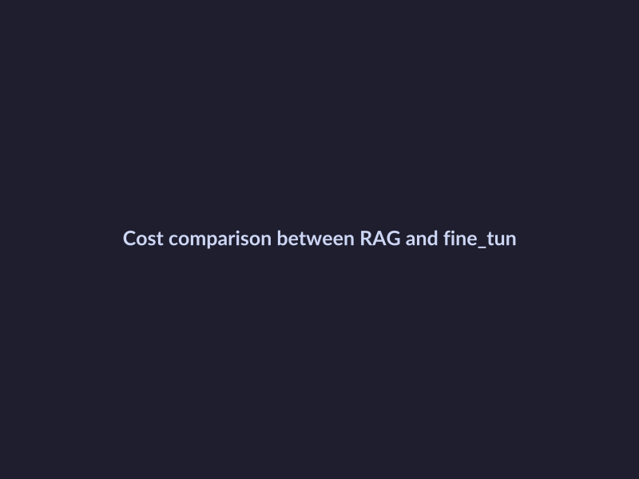
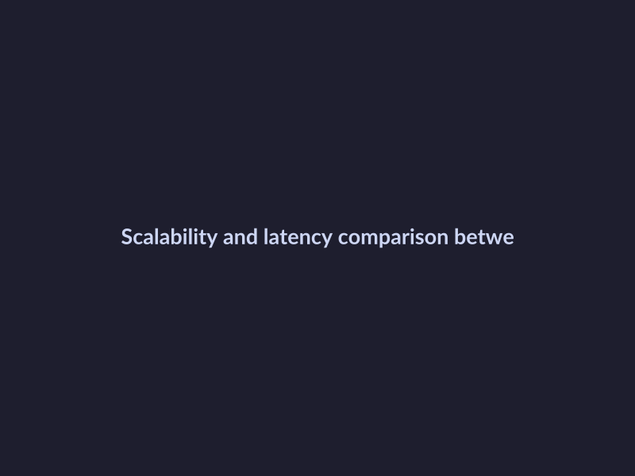
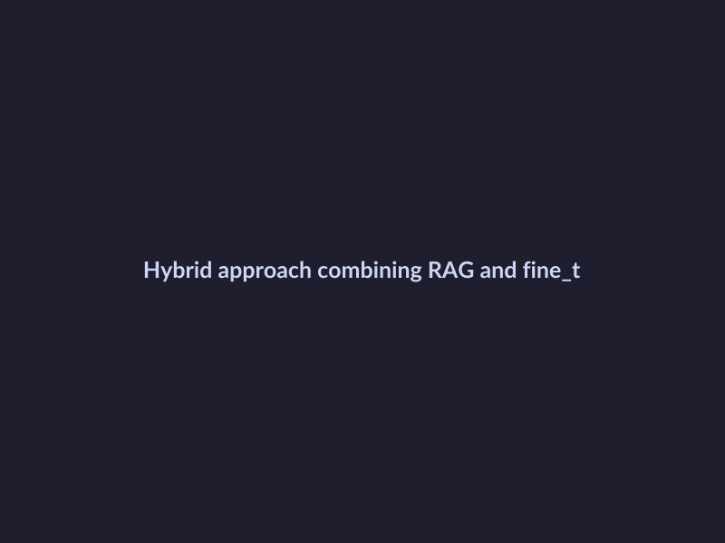

# RAG vs Fine-Tuning: Choosing the Right Approach for Your AI Architecture
## Understanding RAG and Fine-Tuning Basics
Retrieval-Augmented Generation (RAG) is a technique that enhances language model performance by retrieving relevant information from external sources and incorporating it into the generation process. On the other hand, fine-tuning involves adjusting a model's core behavior and skills by training it on a specific dataset, allowing for more precise control over the model's output. RAG is particularly effective in scenarios where the model needs to generate text based on a large corpus of knowledge, while fine-tuning is better suited for tasks that require a high degree of specificity and precision. Companies like Evidently AI have successfully implemented RAG in various applications, demonstrating its potential for real-world use cases.
## Cost Implications of RAG and Fine-Tuning
The cost implications of RAG and fine-tuning are crucial factors to consider when choosing the right approach for your AI architecture. 
- Analyzing the cost of training and maintaining RAG versus fine-tuning, it's evident that RAG requires additional resources for context and retrieval mechanisms, increasing its cost.
- Examining how RAG's context and retrieval add to its cost, we find that the retrieval mechanism can significantly contribute to the overall cost, especially when dealing with large datasets.
- Discussing the stable per-query pricing model of fine-tuning, it's clear that fine-tuning offers a more predictable cost structure, with costs directly proportional to the number of queries. 

*Cost comparison between RAG and fine-tuning*
Companies like Evidently.ai and Cisco have successfully implemented RAG and fine-tuning, respectively, and their experiences can provide valuable insights into the cost implications of these approaches. 
## Evaluating Scalability and Latency
When it comes to deploying AI models in production environments, scalability and latency are crucial factors to consider. Fine-tuning excels at scale and reduces latency, as it allows for more efficient use of computational resources. However, scaling RAG can be challenging due to the complexity of retrieval-augmented generation. To overcome these challenges, strategies such as distributed computing, data parallelism, and model pruning can be employed. 

*Scalability and latency comparison between RAG and fine-tuning*
Several companies have successfully scaled RAG and fine-tuning methods in their production environments. For instance, companies like Elasticsearch Labs have developed practical approaches to RAG, highlighting its potential for scalable and efficient deployment. Additionally, Aisera has provided a comprehensive comparison of RAG and fine-tuning, including their scalability and latency implications. 
## Real-World Applications and Examples
The choice between RAG and fine-tuning depends on various factors, including cost, scalability, and latency. Several companies have successfully implemented these methods, showcasing their benefits and challenges. 
- Present case studies of companies using RAG for its flexibility: Companies like Evidently.ai have utilized RAG for its flexibility. 
- Discuss instances where fine-tuning has been preferred for its scalability and structured outputs: Fine-tuning has been preferred by companies for its scalability. 

*Hybrid approach combining RAG and fine-tuning*
- Examine hybrid approaches that combine elements of both methods: Hybrid approaches have been explored by companies. 
## Choosing the Right Method for Your Use Case
When deciding between RAG and fine-tuning, several key factors should be considered, including:
* Cost implications: RAG can be more cost-effective for certain applications.
* Scalability and latency: Companies like Anyscale have successfully implemented RAG in production, achieving robust scalability.
* Project requirements: A checklist can help determine the most suitable method, considering factors like data size, model complexity, and desired performance.