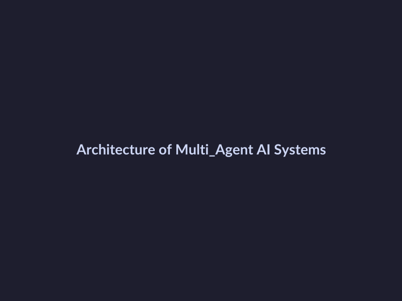
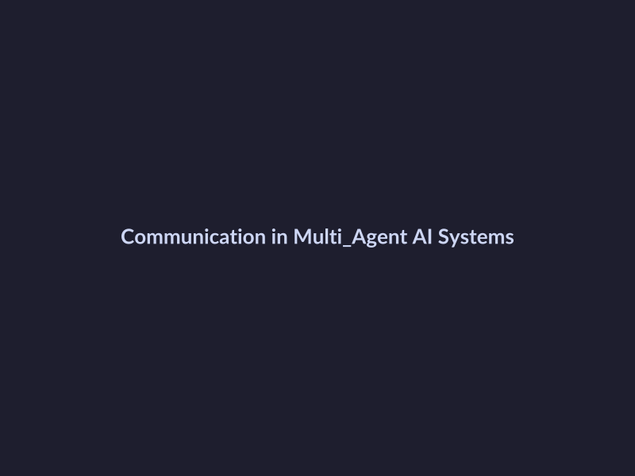
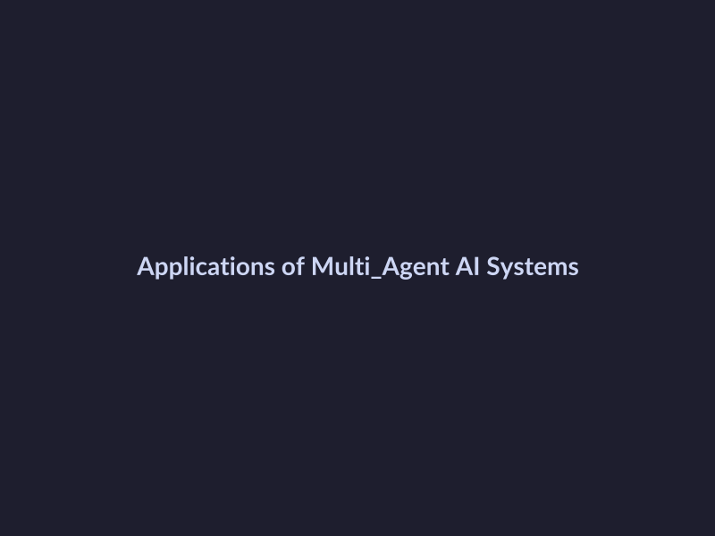

# Revolutionizing Software Development: The Rise of Multi-Agent AI Systems
## Introduction to Multi-Agent AI Systems
Multi-agent AI systems refer to a type of artificial intelligence that involves multiple autonomous agents interacting with each other to achieve a common goal. These systems possess key capabilities such as autonomy, reactivity, and social ability, allowing them to adapt to changing environments and learn from experiences. As of 2026, research and development in multi-agent AI systems are ongoing, with studies focusing on their development and issues. The current state of research and development in this field is rapidly evolving, with potential applications in software development, such as expected to revolutionize the industry.
## How Multi-Agent AI Systems Work
Multi-agent AI systems are composed of multiple autonomous agents that interact and cooperate to achieve common goals. According to IBM, these systems consist of various components, including agents, environment, and interactions. The agents can be heterogeneous, having different capabilities, and can be organized in a hierarchical or flat structure. As explained in Relevance AI, the system components interact through communication and coordination mechanisms, such as message passing or shared memory. 
Decision-making processes in multi-agent AI systems involve conflict resolution mechanisms, such as negotiation or voting, to ensure that the overall system objective is achieved. As discussed in InfoWorld, these mechanisms enable the system to adapt to changing conditions and make decisions in a decentralized manner. 
A study on arXiv provides further insights into the development and issues of multi-agent systems, highlighting the importance of effective communication and coordination in achieving system goals. Overall, the architecture and functionality of multi-agent AI systems enable them to solve complex problems and make decisions in a dynamic and uncertain environment.
## Applications of Multi-Agent AI Systems in Software Development
Multi-agent AI systems are revolutionizing software development by offering a range of potential applications and benefits. Some of the key areas where these systems can be applied include:
* Automated coding and testing: Multi-agent AI systems can automate repetitive coding tasks, such as code generation and testing, freeing up human developers to focus on more complex and creative tasks.
* Project management and coordination: Multi-agent AI systems can help manage and coordinate software development projects, ensuring that tasks are completed efficiently and effectively, as seen in real-world applications.
* Code review and optimization: Multi-agent AI systems can review and optimize code, identifying areas for improvement and suggesting changes to improve performance and efficiency, as discussed in research studies. 
According to IBM, multi-agent systems can have a significant impact on the software development industry, enabling the creation of more complex and sophisticated software systems. 
As noted by Relevance AI, the use of multi-agent AI systems in software development has the potential to transform the industry, enabling the creation of more efficient, effective, and autonomous software systems. 
For more information on multi-agent AI systems, see Wikipedia and Gartner.
## Real-World Examples and Case Studies
The application of multi-agent AI systems in software development has yielded numerous success stories and lessons learned. For instance, multi-agent AI workflows have been shown to enhance collaboration and efficiency in development teams. Additionally, a large-scale study on multi-agent systems highlighted the benefits of autonomous decision-making and adaptability in complex software development environments. However, challenges and limitations, such as scalability and coordination, must be addressed to fully realize the potential of multi-agent AI systems. Looking ahead, future directions and potential applications include autonomous enterprise automation and transformative AI solutions, which can revolutionize the software development industry and beyond. As noted in a study on multi-agent systems, the future of AI-driven enterprise automation relies heavily on the development and implementation of these systems.
## The Future of Multi-Agent AI Systems in Software Development
The future of multi-agent AI systems in software development holds tremendous potential, with several key areas driving growth and innovation. 
* Advancements in coordination algorithms and machine learning are expected to improve the efficiency and effectiveness of multi-agent AI systems, enabling them to tackle complex tasks and make decisions autonomously.
* Scalability solutions and integration with existing tools will be crucial in ensuring the widespread adoption of multi-agent AI systems, allowing developers to seamlessly incorporate them into their workflows.
* However, ethical considerations and potential risks associated with multi-agent AI systems must also be addressed, such as ensuring transparency, accountability, and fairness in decision-making processes. 
As the field continues to evolve, we can expect to see significant advancements in the development and application of multi-agent AI systems, transforming the software development landscape and enabling the creation of more sophisticated, autonomous, and efficient systems.

*The architecture of multi-agent AI systems, showing the interactions between agents, environment, and interactions.*
## Architecture of Multi-Agent AI Systems
The architecture of multi-agent AI systems is designed to facilitate communication, coordination, and decision-making among multiple autonomous agents. 
*The communication mechanisms used in multi-agent AI systems, such as message passing or shared memory.*
## Applications of Multi-Agent AI Systems
Multi-agent AI systems have a wide range of applications in software development, including automated coding, project management, and code review. 
*The applications of multi-agent AI systems in software development, including automated coding, project management, and code review.*