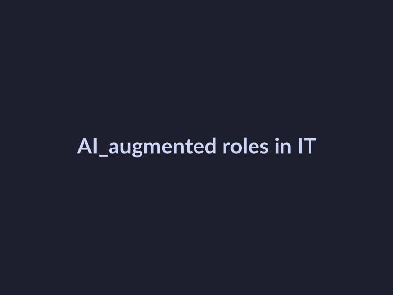

# The AI Effect in IT Jobs: Trends and Strategies

## Understand the AI Effect in IT Jobs

The AI effect in IT jobs has become a pressing concern for professionals in the industry. As AI technologies continue to advance and integrate into various aspects of IT, there is a growing need to comprehend the implications of this phenomenon.

### Define the AI Effect in IT Jobs and Its Causes

The AI effect in IT jobs refers to the transformative impact of artificial intelligence on the job market, leading to changes in job roles, responsibilities, and overall employment landscape. The primary causes of the AI effect include:

* Automation: AI-powered tools and systems are increasingly capable of automating routine and repetitive tasks, freeing up human resources for higher-value tasks.
* Enhanced productivity: AI-driven workflows and processes have led to significant productivity gains, making businesses more efficient and competitive.
* Changing workforce requirements: As AI assumes certain tasks, there is a growing need for professionals with skills that complement AI capabilities.

### Explain How AI Is Changing Job Roles and Responsibilities

AI is redefining job roles and responsibilities across various IT functions, including:

* Data scientists: Focus shifting from traditional data analysis to developing and training AI models.
* Software developers: Emphasis on designing and integrating AI-powered systems and applications.
* IT operations: AI-assisted monitoring and management of infrastructure and services.

### Discuss the Impact of AI on Job Security and Employment

The AI effect has significant implications for job security and employment in IT, including:

* Job displacement: AI-powered automation may displace certain job roles, particularly those that involve routine and repetitive tasks.
* New job creation: AI is creating new job opportunities in fields such as AI development, deployment, and maintenance.
* Upskilling and reskilling: Professionals must adapt to changing job requirements by acquiring new skills and expertise.

### Identify Emerging Job Opportunities in AI-Related Fields

As AI continues to advance, new job opportunities are emerging in fields such as:

* AI ethics and governance
* Explainable AI (XAI)
* Human-AI collaboration
* AI-based decision-making

These emerging fields require professionals with expertise in AI, data science, and related domains to develop and implement AI solutions that drive business value while ensuring responsible AI practices.

## Develop AI-Enabled Skills

As AI continues to transform the IT industry, staying ahead of the curve is crucial for IT professionals and technical leaders. Here are some essential skills to acquire and a plan to develop them.

### Top AI-Enabled Skills in Demand

* **Machine Learning (ML)**: Understanding ML algorithms, model training, and deployment is vital for working with AI systems.
* **Deep Learning (DL)**: Familiarity with DL techniques, such as neural networks and CNNs, is essential for image and speech recognition, natural language processing, and more.
* **Data Science**: Proficiency in data analysis, visualization, and interpretation is necessary for extracting insights from AI-generated data.
* **Cloud Computing**: Knowledge of cloud platforms, such as AWS or Azure, is required for deploying and managing AI models.
* **Python Programming**: Python is a primary language for AI development, and proficiency in it is essential for working with popular libraries like TensorFlow or PyTorch.

### Benefits of Acquiring AI Skills

* **Increased Job Prospects**: AI skills are in high demand, making IT professionals more attractive to potential employers.
* **Higher Salary Potential**: IT professionals with AI skills tend to earn higher salaries due to their expertise.
* **Enhanced Problem-Solving**: AI skills enable IT professionals to tackle complex problems and develop innovative solutions.
* **Improved Decision-Making**: AI skills equip IT professionals with the ability to analyze large datasets and make informed decisions.

### Acquiring AI Skills

1. **Online Courses**: Websites like Coursera, edX, and Udemy offer a wide range of AI-related courses. For example, you can take a course on "Machine Learning" from Stanford University on Coursera.
2. **Certifications**: Obtain certifications from reputable organizations, such as Google Cloud Certification or Microsoft Certified: Azure Developer Associate.
3. **Degree Programs**: Pursue a degree in AI, computer science, or a related field to gain in-depth knowledge and expertise.
4. **Professional Development**: Stay updated with AI developments by attending conferences, meetups, and webinars.

### Staying Up-to-Date with AI Developments

* **Subscribe to Industry Newsletters**: Stay informed about the latest AI trends, breakthroughs, and innovations.
* **Attend Conferences and Meetups**: Network with AI professionals and learn about new developments firsthand.
* **Participate in Online Communities**: Engage with AI enthusiasts and experts on platforms like Kaggle, Reddit, or GitHub.
* **Read AI-Related Books**: Expand your knowledge by reading books on AI, machine learning, and related topics.

By following these steps, IT professionals and technical leaders can develop the essential AI-enabled skills needed to stay ahead in the industry.

## Embrace AI-Augmented Roles

As AI technologies continue to advance and integrate into IT job roles, it's essential for professionals and leaders to understand the benefits and implications of AI-augmented work. In this section, we'll explore how AI can augment existing job roles and responsibilities in IT, and discuss strategies for thriving in this new landscape.

### AI-Augmented Roles in IT

AI-augmented roles in IT involve leveraging AI technologies to enhance productivity, accuracy, and decision-making. Some examples of AI-augmented roles in IT include:

* **AI-assisted software development**: AI can help automate testing, code review, and deployment processes, freeing up developers to focus on high-level design and innovation.
* **Predictive maintenance**: AI-powered analytics can predict equipment failures, reducing downtime and improving overall system reliability.
* **Automated incident response**: AI can quickly identify and respond to security incidents, reducing mean time to detect (MTTD) and mean time to respond (MTTR).

The benefits of AI-augmented roles in IT include:

* **Increased productivity**: AI can automate repetitive tasks, freeing up human resources for more strategic and creative work.
* **Improved accuracy**: AI can reduce errors and improve decision-making accuracy through data-driven insights.
* **Enhanced collaboration**: AI can facilitate collaboration between humans and machines, leading to better outcomes and more efficient workflows.

### Collaborating with AI Systems

To maximize the benefits of AI-augmented roles, IT professionals and leaders must learn to collaborate effectively with AI systems. This involves:

* **Understanding AI capabilities and limitations**: IT professionals must have a clear understanding of what AI can and cannot do, and how to integrate AI into their workflows.
* **Defining clear goals and objectives**: IT leaders must clearly define the goals and objectives of AI-augmented projects, and ensure that AI systems are aligned with these objectives.
* **Developing human-AI collaboration skills**: IT professionals must develop the skills necessary to collaborate effectively with AI systems, including communication, adaptability, and critical thinking.

### Adaptability and Continuous Learning

In an AI-augmented work environment, adaptability and continuous learning are essential skills. IT professionals and leaders must be able to:

* **Embrace change**: IT professionals must be willing to learn new skills and adapt to new technologies and workflows.
* **Stay up-to-date with industry trends**: IT leaders must stay informed about the latest industry trends and developments, and be able to apply this knowledge to their work.
* **Focus on high-level skills**: IT professionals must focus on developing high-level skills that are less likely to be automated, such as creativity, problem-solving, and critical thinking.

### Mitigating Job Displacement

While AI-augmented roles can bring many benefits, they also raise concerns about job displacement. To mitigate these concerns, IT professionals and leaders can:

* **Develop skills that complement AI**: IT professionals can develop skills that complement AI, such as data science, machine learning, and human-computer interaction.
* **Focus on high-level tasks**: IT professionals can focus on high-level tasks that require creativity, problem-solving, and critical thinking.
* **Emphasize human skills**: IT leaders can emphasize the importance of human skills, such as communication, collaboration, and empathy.

*Visualizing the future of work*
## AI-Augmented Roles in IT: Visualizing the Future

As AI continues to transform the IT industry, it's essential to visualize the future of work and identify emerging trends and opportunities. Here's a visual representation of AI-augmented roles in IT:

[[IMAGE_2]]
## Embracing the Future of Work

The future of work is changing rapidly, and IT professionals and leaders must be prepared to adapt to these changes. By embracing AI-augmented roles and developing the necessary skills, we can create a brighter future for ourselves and our organizations.

[[IMAGE_3]]