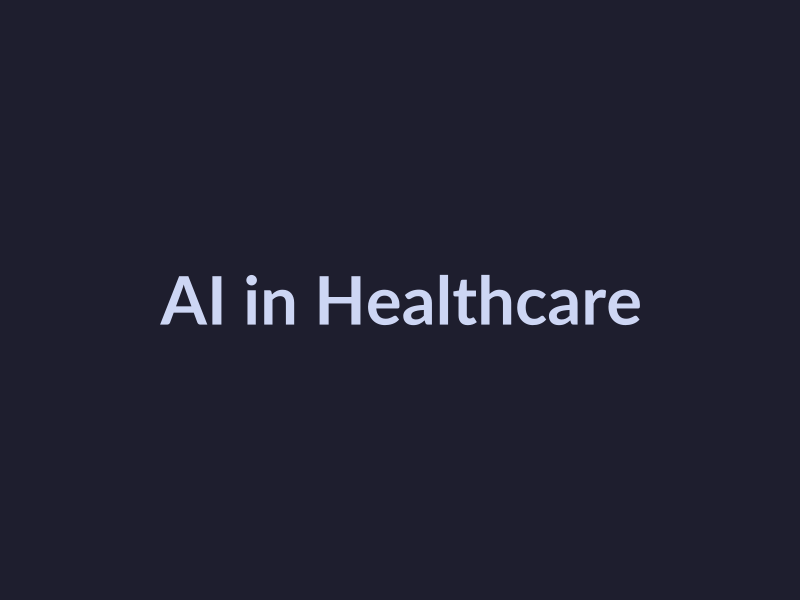
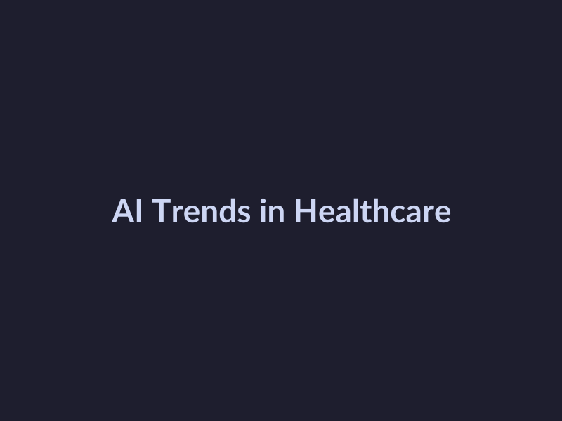
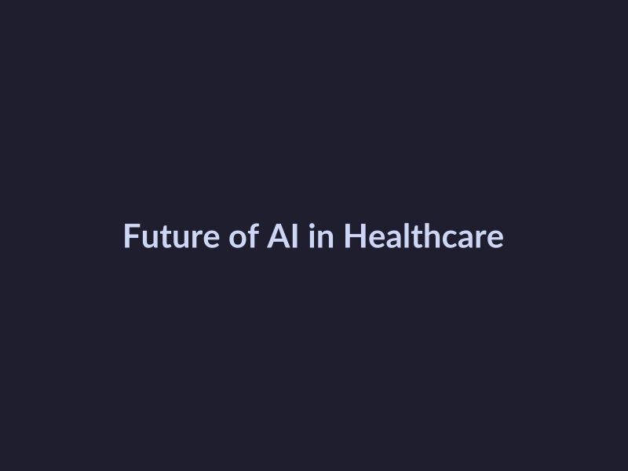

# The Future of Healthcare: How AI is Revolutionizing the Industry
## Introduction to AI in Healthcare
Artificial intelligence (AI) in healthcare refers to the use of machine learning algorithms and other artificial intelligence techniques to analyze medical data, diagnose diseases, and develop personalized treatment plans [([AI in Medicine | NEJM](https://www.nejm.org/ai-in-medicine))](https://www.nejm.org/ai-in-medicine). The applications of AI in healthcare are vast, ranging from clinical decision support systems to medical imaging analysis [([Artificial intelligence in medicine: current trends and future possibilities](https://pmc.ncbi.nlm.nih.gov/articles/PMC5819974))](https://pmc.ncbi.nlm.nih.gov/articles/PMC5819974). As of 2026, the current state of AI in healthcare is rapidly evolving, with ongoing research and development in areas such as natural language processing, computer vision, and predictive analytics [([2026 healthcare AI trends: Insights from experts | Wolters Kluwer](https://www.wolterskluwer.com/en/expert-insights/2026-healthcare-ai-trends-insights-from-experts))](https://www.wolterskluwer.com/en/expert-insights/2026-healthcare-ai-trends-insights-from-experts). According to experts, AI is expected to play a significant role in shaping the future of healthcare, with potential applications in areas such as disease diagnosis, patient engagement, and population health management [([Top Digital Health And Healthcare AI Trends To Watch In 2026](https://www.linkedin.com/pulse/top-digital-health-healthcare-ai-trends-watch-2026-mesk%C3%B3-md-phd-qyz9f))](https://www.linkedin.com/pulse/top-digital-health-healthcare-ai-trends-watch-2026-mesk%C3%B3-md-phd-qyz9f).
## Current Trends in AI for Healthcare
The integration of Artificial Intelligence (AI) in healthcare has led to significant advancements in the industry. Currently, two major trends are dominating the landscape: the use of AI in medical imaging and the role of AI in patient data analysis. 
* The use of AI in medical imaging has improved diagnosis accuracy and speed. For instance, AI algorithms can analyze medical images such as X-rays and MRIs to detect abnormalities, allowing healthcare professionals to make more accurate diagnoses [Source](https://pmc.ncbi.nlm.nih.gov/articles/PMC5819974).
* The role of AI in patient data analysis has also been instrumental in identifying patterns and trends that may not be apparent to human analysts. AI can analyze large amounts of patient data, including electronic health records, medical histories, and test results, to identify high-risk patients and predict patient outcomes [Source](https://www.wolterskluwer.com/en/expert-insights/2026-healthcare-ai-trends-insights-from-experts). 
These trends are expected to continue shaping the future of healthcare, with AI playing an increasingly important role in improving patient care and outcomes. As noted by experts in the field, AI has the potential to revolutionize healthcare by improving diagnosis, treatment, and patient care [Source](https://www.nyas.org/shaping-science/events/the-new-wave-of-ai-in-healthcare-2026).
## Future Possibilities for AI in Healthcare
The future of AI in healthcare holds tremendous promise, with potential applications in personalized medicine and healthcare automation. 
* The potential for AI in personalized medicine is vast, as it can help tailor treatment plans to individual patients based on their unique genetic profiles, medical histories, and lifestyle factors [Source](https://pmc.ncbi.nlm.nih.gov/articles/PMC5819974). 
* Additionally, AI can aid in healthcare automation by streamlining clinical workflows, reducing administrative burdens, and enhancing patient care [Source](https://www.wolterskluwer.com/en/expert-insights/2026-healthcare-ai-trends-insights-from-experts). 
As AI technology continues to evolve, we can expect to see even more innovative applications in healthcare, from predictive analytics to virtual nursing assistants [Source](https://www.nejm.org/ai-in-medicine). 
Experts predict that AI will play an increasingly important role in shaping the future of healthcare, with top trends to watch in 2026 including the use of AI for clinical decision support, patient engagement, and population health management [Source](https://www.dataiku.com/stories/blog/healthcare-life-sciences-ai-trends-2026). 
With the potential to revolutionize healthcare as we know it, AI is an exciting and rapidly evolving field that holds great promise for improving patient outcomes and transforming the healthcare industry [Source](https://healthtechmagazine.net/article/2026/01/tech-trends-healthcare-it-leaders-get-real-state-ai-2026).
## Challenges and Limitations of AI in Healthcare
The integration of AI in healthcare poses several challenges and limitations that must be addressed. 
* Discussing the ethical considerations of AI in healthcare is crucial, as it raises concerns about patient data privacy and security, as well as potential biases in AI algorithms [([Source](https://pmc.ncbi.nlm.nih.gov/articles/PMC5819974))](https://pmc.ncbi.nlm.nih.gov/articles/PMC5819974). 
* Explaining the potential risks of AI in healthcare, such as errors in diagnosis or treatment, is also essential [([Source](https://www.nejm.org/ai-in-medicine))](https://www.nejm.org/ai-in-medicine). 
These challenges and limitations highlight the need for careful consideration and regulation of AI in healthcare to ensure its safe and effective use.
## Conclusion
The current state of AI in healthcare is rapidly evolving, with [experts predicting significant trends in 2026](https://www.wolterskluwer.com/en/expert-insights/2026-healthcare-ai-trends-insights-from-experts). As noted in [recent research](https://pmc.ncbi.nlm.nih.gov/articles/PMC5819974), AI is being applied in various areas, including diagnosis, treatment, and patient care. Looking ahead, the future possibilities for AI in healthcare are vast, with potential applications in [personalized medicine](https://www.nyas.org/shaping-science/events/the-new-wave-of-ai-in-healthcare-2026) and [clinical decision support](https://www.nejm.org/ai-in-medicine). As the industry continues to advance, it is essential for healthcare professionals to stay informed about the latest developments and [trends in AI](https://www.dataiku.com/stories/blog/healthcare-life-sciences-ai-trends-2026) to provide the best possible care for patients.

*AI in Healthcare*

## Current Trends in AI for Healthcare
The integration of Artificial Intelligence (AI) in healthcare has led to significant advancements in the industry. Currently, two major trends are dominating the landscape: the use of AI in medical imaging and the role of AI in patient data analysis. 
* The use of AI in medical imaging has improved diagnosis accuracy and speed. For instance, AI algorithms can analyze medical images such as X-rays and MRIs to detect abnormalities, allowing healthcare professionals to make more accurate diagnoses [Source](https://pmc.ncbi.nlm.nih.gov/articles/PMC5819974).
* The role of AI in patient data analysis has also been instrumental in identifying patterns and trends that may not be apparent to human analysts. AI can analyze large amounts of patient data, including electronic health records, medical histories, and test results, to identify high-risk patients and predict patient outcomes [Source](https://www.wolterskluwer.com/en/expert-insights/2026-healthcare-ai-trends-insights-from-experts). 
These trends are expected to continue shaping the future of healthcare, with AI playing an increasingly important role in improving patient care and outcomes. As noted by experts in the field, AI has the potential to revolutionize healthcare by improving diagnosis, treatment, and patient care [Source](https://www.nyas.org/shaping-science/events/the-new-wave-of-ai-in-healthcare-2026).

*AI Trends in Healthcare*

## Future Possibilities for AI in Healthcare
The future of AI in healthcare holds tremendous promise, with potential applications in personalized medicine and healthcare automation. 
* The potential for AI in personalized medicine is vast, as it can help tailor treatment plans to individual patients based on their unique genetic profiles, medical histories, and lifestyle factors [Source](https://pmc.ncbi.nlm.nih.gov/articles/PMC5819974). 
* Additionally, AI can aid in healthcare automation by streamlining clinical workflows, reducing administrative burdens, and enhancing patient care [Source](https://www.wolterskluwer.com/en/expert-insights/2026-healthcare-ai-trends-insights-from-experts). 
As AI technology continues to evolve, we can expect to see even more innovative applications in healthcare, from predictive analytics to virtual nursing assistants [Source](https://www.nejm.org/ai-in-medicine). 
Experts predict that AI will play an increasingly important role in shaping the future of healthcare, with top trends to watch in 2026 including the use of AI for clinical decision support, patient engagement, and population health management [Source](https://www.dataiku.com/stories/blog/healthcare-life-sciences-ai-trends-2026). 
With the potential to revolutionize healthcare as we know it, AI is an exciting and rapidly evolving field that holds great promise for improving patient outcomes and transforming the healthcare industry [Source](https://healthtechmagazine.net/article/2026/01/tech-trends-healthcare-it-leaders-get-real-state-ai-2026).

*Future of AI in Healthcare*

