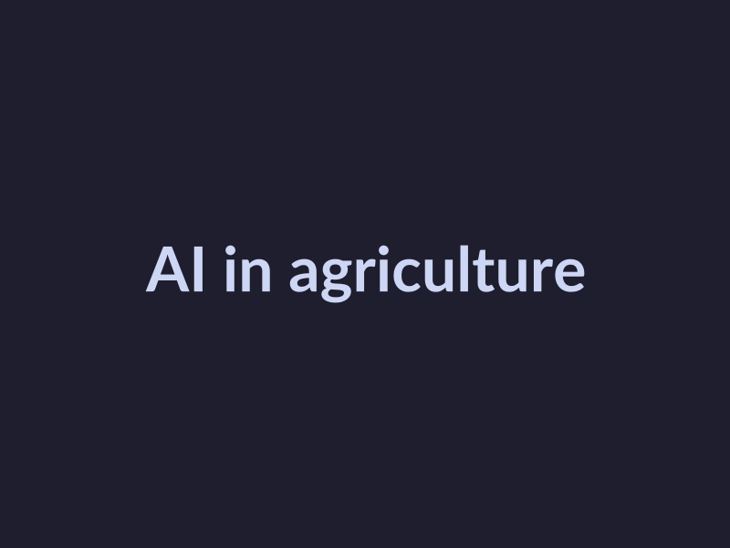
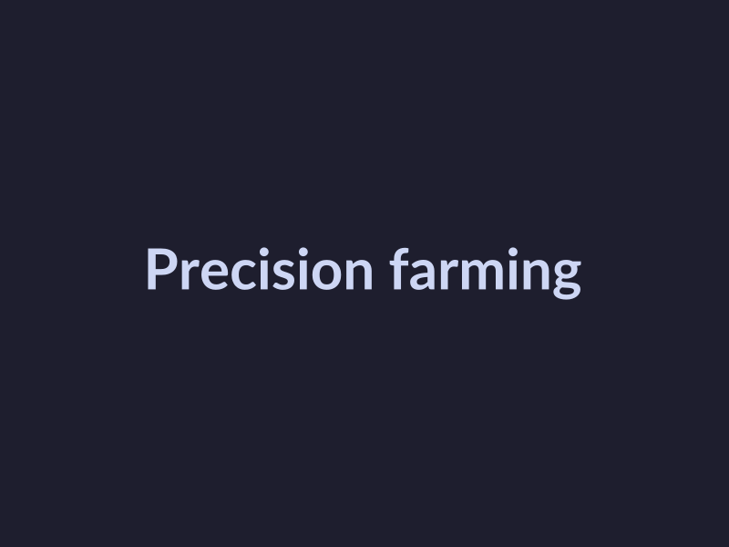
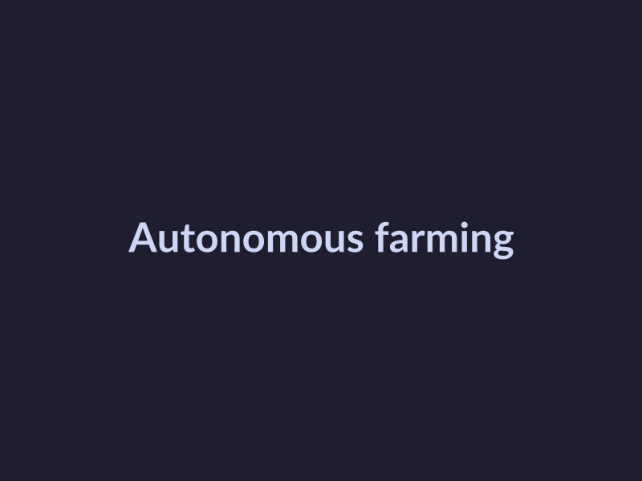

# The Impact of AI in Agriculture: A Comprehensive Guide
## Introduction to AI in Agriculture
Artificial Intelligence (AI) refers to the development of computer systems that can perform tasks that would typically require human intelligence, such as learning, problem-solving, and decision-making [([AI in Agriculture Explained](https://www.youtube.com/watch?v=HrorJDcnbZI))](https://www.youtube.com/watch?v=HrorJDcnbZI). The history of AI in agriculture dates back to the 1960s, but it wasn't until recent years that the technology has started to gain significant traction [([Precision Agriculture: The farming in the era of AI](https://www.youtube.com/watch?v=zZuTzOj-_ps))](https://www.youtube.com/watch?v=zZuTzOj-_ps). Currently, AI is being used in various aspects of agriculture, including precision farming, crop yield prediction, and automated farming systems [([Applications of Artificial Intelligence for Precision Agriculture](https://geopard.tech/blog/applications-of-artificial-intelligence-for-precision-agriculture))](https://geopard.tech/blog/applications-of-artificial-intelligence-for-precision-agriculture). As the technology continues to evolve, it is expected to have a significant impact on the future of agriculture, with many experts predicting that it will play a key role in increasing efficiency, reducing waste, and improving crop yields [([Agriculture in 2026: Moving From AI Hype to ROI & Resilience](https://www.icl-group.com/blog/agriculture-in-2026-moving-from-ai-hype-to-roi-resilience))](https://www.icl-group.com/blog/agriculture-in-2026-moving-from-ai-hype-to-roi-resilience).
## Precision Farming with AI
Precision farming is a crucial aspect of modern agriculture, and AI is playing a significant role in its development. With the help of AI, farmers can now monitor their crops more efficiently, analyze soil conditions, and make data-driven decisions to improve crop yields. Some of the key applications of AI in precision farming include:
* Crop monitoring: AI-powered sensors and drones can monitor crop health, detect pests and diseases, and predict yield [Source](https://www.youtube.com/watch?v=zZuTzOj-_ps). This information can be used to optimize irrigation, fertilization, and pest control.
* Soil analysis: AI can analyze soil samples to determine nutrient levels, pH, and other factors that affect crop growth [Source](https://geopard.tech/blog/applications-of-artificial-intelligence-for-precision-agriculture). This information can be used to create personalized fertilizer recommendations and optimize soil health.
* Predictive analytics: AI can analyze historical climate data, soil conditions, and crop yields to predict future crop performance [Source](https://www.nature.com/articles/s41598-026-35716-x). This information can be used to make informed decisions about planting, harvesting, and resource allocation. By leveraging these technologies, farmers can reduce waste, improve efficiency, and increase crop yields, ultimately contributing to a more sustainable and productive agricultural industry [Source](https://ambiq.com/blog/how-ai-technology-is-revolutionizing-agriculture).
## AI-Powered Farming Tools
The integration of AI in agriculture has led to the development of various innovative farming tools, transforming the way farmers manage their land, crops, and resources. Some of the key AI-powered farming tools include:
* Farm management software, which enables farmers to optimize crop yields, reduce waste, and improve resource allocation, as discussed in [Precision Agriculture: The farming in the era of AI](https://www.youtube.com/watch?v=zZuTzOj-_ps).
* Autonomous tractors, which can automate tasks such as planting, harvesting, and crop monitoring, increasing efficiency and reducing labor costs, as highlighted in [AI in Agriculture Explained: What Every African Farmer Must Know](https://www.youtube.com/watch?v=HrorJDcnbZI).
* Drones, which can be equipped with sensors and cameras to collect data on crop health, soil conditions, and weather patterns, allowing farmers to make data-driven decisions, as explored in [Precision Farming and AI: The Unseen Revolution](https://numalis.com/precision-farming-ai-revolution).
These AI-powered farming tools have the potential to increase crop yields, reduce environmental impact, and improve the overall sustainability of agricultural practices, as noted in [Agriculture in 2026: Moving From AI Hype to ROI & Resilience](https://www.icl-group.com/blog/agriculture-in-2026-moving-from-ai-hype-to-roi-resilience). By leveraging these technologies, farmers can stay ahead of the curve and capitalize on the benefits of AI in agriculture.
## Challenges and Limitations of AI in Agriculture
The integration of AI in agriculture has shown tremendous potential, but it is not without its challenges and limitations. Some of the key issues that farmers and agricultural stakeholders face include:
* Data quality: The accuracy and reliability of data used to train AI models is crucial, but [agricultural data can be noisy and inconsistent](https://www.youtube.com/watch?v=HrorJDcnbZI), making it challenging to develop effective AI solutions [as noted in various studies](https://www.researchgate.net/publication/380545512_Precision_agriculture_using_artificial_intelligence_and_robotics).
* Access to technology: The adoption of AI in agriculture requires significant investment in technology, including hardware, software, and connectivity, which can be a barrier for small-scale farmers [as discussed at the CDA Conference 2026](https://digitalag.illinois.edu/cda-con-2026).
* Regulatory frameworks: The use of AI in agriculture is still largely unregulated, and the lack of clear guidelines and standards can create uncertainty and risks for farmers and investors [as highlighted in the Elevate 2026 summit](https://grandfarm.com/elevate). According to [Syngenta](https://www.syngenta.com/agriculture/agricultural-technology/artificial-intelligence), addressing these challenges will be crucial to realizing the full potential of AI in agriculture.
## Future of AI in Agriculture
The future of AI in agriculture is promising, with several emerging trends that are expected to shape the industry. Some of these trends include the use of [precision agriculture](https://geopard.tech/blog/applications-of-artificial-intelligence-for-precision-agriculture) and [artificial intelligence for crop yield prediction](https://www.innominds.com/blog/how-ai-helps-in-precision-agriculture-connected-farm-experience-better-crop-yield). Future applications of AI in agriculture may include [autonomous farming](https://numalis.com/precision-farming-ai-revolution) and [smart agriculture](https://www.mdpi.com/2078-2489/16/2/100). The potential impact of AI on agriculture is significant, with the potential to [increase crop yields](https://intellias.com/artificial-intelligence-in-agriculture) and [improve water efficiency](https://medium.com/mark-and-focus/precision-agriculture-ai-and-water-efficiency-the-future-of-farming-b959ac0b6017). As noted by [Syngenta](https://www.syngenta.com/agriculture/agricultural-technology/artificial-intelligence), AI has the potential to revolutionize agriculture. According to [McKinsey](https://www.mckinsey.com/industries/agriculture/our-insights/from-bytes-to-bushels-how-gen-ai-can-shape-the-future-of-agriculture), gen AI can shape the future of agriculture by improving decision-making and forecasting. Overall, the future of AI in agriculture is exciting, with many potential benefits for farmers and the environment. For more information on the future of AI in agriculture, you can visit the [Elevate 2026](https://grandfarm.com/elevate) summit or the [CDA Conference 2026](https://digitalag.illinois.edu/cda-con-2026).

*AI in agriculture*
## Conclusion
In conclusion, AI has the potential to revolutionize the agriculture industry by increasing efficiency, reducing waste, and improving crop yields. While there are challenges and limitations to the adoption of AI in agriculture, the potential benefits make it an exciting and promising field. As the technology continues to evolve, it is likely that we will see even more innovative applications of AI in agriculture, from precision farming to autonomous farming. By embracing AI and its potential, farmers and agricultural stakeholders can stay ahead of the curve and capitalize on the benefits of this technology.

*Precision farming*
## References
* [AI in Agriculture Explained](https://www.youtube.com/watch?v=HrorJDcnbZI)
* [Precision Agriculture: The farming in the era of AI](https://www.youtube.com/watch?v=zZuTzOj-_ps)
* [Applications of Artificial Intelligence for Precision Agriculture](https://geopard.tech/blog/applications-of-artificial-intelligence-for-precision-agriculture)
* [Agriculture in 2026: Moving From AI Hype to ROI & Resilience](https://www.icl-group.com/blog/agriculture-in-2026-moving-from-ai-hype-to-roi-resilience)
* [Precision Farming and AI: The Unseen Revolution](https://numalis.com/precision-farming-ai-revolution)

*Autonomous farming*