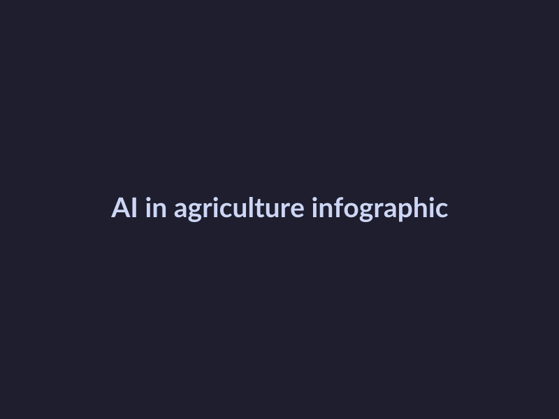
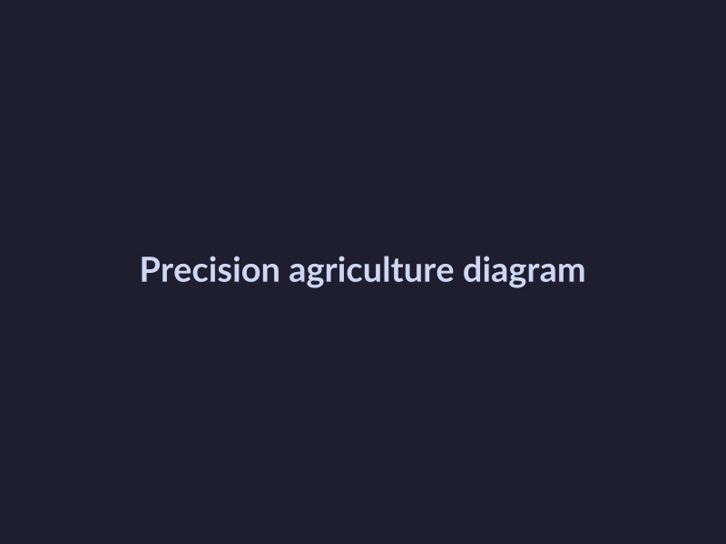
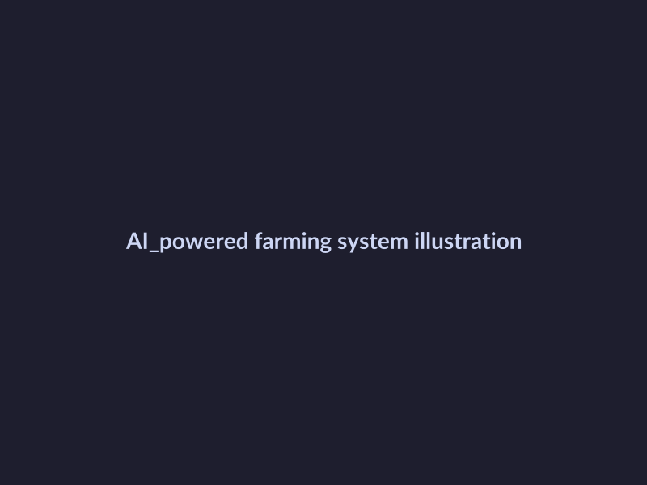

# The Impact of AI on Agriculture Farming
## Introduction to AI in Agriculture
The integration of Artificial Intelligence (AI) in agriculture has been transforming the farming industry in recent years. To understand the basics of AI in agriculture, it is essential to start with its definition. AI in agriculture refers to the use of artificial intelligence technologies, such as machine learning and computer vision, to improve farming practices and increase crop yields.
The history of AI in agriculture dates back to the early 2000s, but it has gained significant momentum in the past decade with the advent of precision agriculture.
As of 2026, the current state of AI in agriculture is focused on solving real-world problems, such as crop yield prediction, soil health monitoring, and automated farming equipment, with various conferences and summits, like the CDA Conference 2026 and Elevate 2026, being organized to discuss the latest developments and trends in the field.
## Applications of AI in Precision Agriculture
The integration of Artificial Intelligence (AI) in precision agriculture has revolutionized the way farmers manage their crops, soil, and resources. Some of the key applications of AI in precision agriculture include:
* Crop yield prediction: AI algorithms can analyze historical climate data, soil conditions, and crop varieties to predict crop yields, allowing farmers to make informed decisions about planting, harvesting, and resource allocation.
* Soil analysis: AI-powered sensors and drones can collect data on soil moisture, temperature, and nutrient levels, enabling farmers to optimize fertilizer application, irrigation, and crop rotation.
* Predictive analytics: AI can analyze data from various sources, including weather forecasts, soil conditions, and crop health, to predict potential issues and enable proactive decision-making.
* Crop disease detection: AI-powered computer vision can detect early signs of crop disease, allowing farmers to take prompt action to prevent the spread of disease and reduce the use of chemical pesticides.

*AI in agriculture infographic*
## Benefits and Challenges of AI in Agriculture
The integration of AI in agriculture has brought about several benefits, including:
* Increased efficiency, as AI-powered tools can automate tasks such as crop monitoring and irrigation management.
* Improved crop yields, achieved through the use of machine learning algorithms that can predict and prevent crop diseases.
* Reduced labor costs, resulting from the automation of tasks that were previously manual.
However, there are also challenges associated with the use of AI in agriculture, including:
* Data privacy concerns, as the collection and analysis of farm data can raise concerns about who has access to this information.

*Precision agriculture diagram*
## Future of AI in Agriculture
The future of AI in agriculture is poised to be shaped by several emerging trends, including the increasing use of machine learning for crop yield prediction and precision agriculture. New technologies such as artificial intelligence and robotics are being developed to support these trends. Potential applications of AI in agriculture include improving crop yields, enhancing water efficiency, and optimizing farm management.

*AI-powered farming system illustration*
## Case Studies of AI in Agriculture
The integration of Artificial Intelligence (AI) in agriculture has led to numerous successful implementations, lessons learned, and best practices. Successful implementations of AI in agriculture include the use of machine learning algorithms for crop yield prediction, precision farming, and automated farming systems.
Lessons learned from these implementations highlight the importance of data quality, sensor calibration, and farmer engagement.
Best practices for AI adoption in agriculture include starting small, focusing on specific problems, and collaborating with experts.
These case studies demonstrate the potential of AI to transform agriculture, and by learning from them, farmers and stakeholders can make informed decisions about AI adoption.