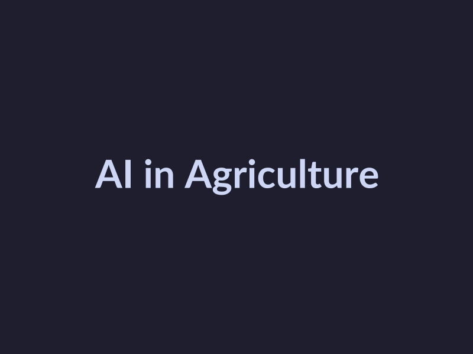
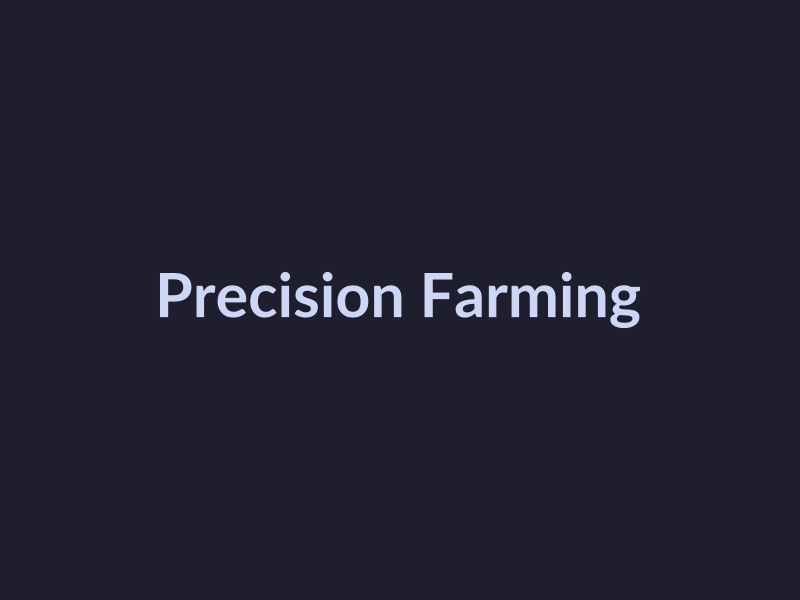
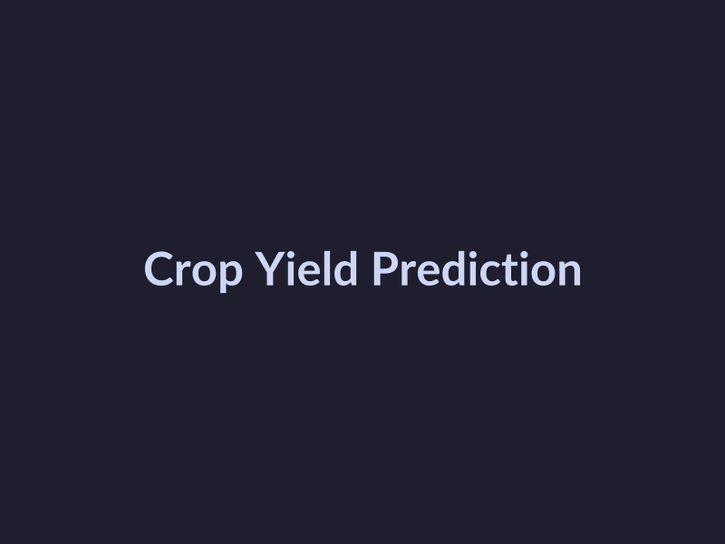

# The Impact of AI on Agriculture Farming: A Comprehensive Guide
## Introduction to AI in Agriculture
The integration of Artificial Intelligence (AI) in agriculture has been gaining momentum, transforming the way farmers cultivate and harvest crops. To understand the basics of AI in agriculture, it's essential to start with the **definition of AI in agriculture**, which refers to the use of machine learning algorithms and data analysis to improve crop yields, reduce waste, and enhance farming practices [Source](https://www.youtube.com/watch?v=HrorJDcnbZI). 
The **history of AI in agriculture** dates back to the early 2000s, but it's only recently that AI has started to make a significant impact on the industry [Source](https://intellias.com/artificial-intelligence-in-agriculture). 
As of 2026, the **current state of AI in agriculture** is focused on moving from hype to tangible results, with many conferences and summits, such as the [CDA Conference 2026](https://digitalag.illinois.edu/cda-con-2026) and [Elevate 2026](https://grandfarm.com/elevate), highlighting the importance of AI in agriculture. 
With the increasing use of AI in agriculture, it's crucial to explore its applications, benefits, and challenges to understand its potential to revolutionize the farming industry.
## Benefits of AI in Agriculture
The integration of Artificial Intelligence (AI) in agriculture has numerous benefits, including:
* Increased crop yields: AI can help farmers predict and prevent crop diseases, as well as optimize crop growth through precision farming techniques, such as [machine learning for crop yield prediction](https://saiwa.ai/sairone/blog/crop-yield-prediction-using-machine-learning).
* Improved resource allocation: AI can analyze data on weather, soil, and crop health to optimize the use of resources such as water, fertilizers, and pesticides, as discussed in the [AI in Agriculture Explained](https://www.youtube.com/watch?v=HrorJDcnbZI) video.
* Enhanced decision-making: AI can provide farmers with data-driven insights to make informed decisions about planting, harvesting, and crop management, which is a key topic at the [Elevate 2026](https://grandfarm.com/elevate) summit.
By leveraging these benefits, farmers can improve the efficiency and productivity of their farms, while also reducing waste and environmental impact, as highlighted in the [Agriculture in 2026](https://www.icl-group.com/blog/agriculture-in-2026-moving-from-ai-hype-to-roi-resilience) blog post. Additionally, AI can help farmers adapt to changing climate conditions and mitigate the effects of climate change on agriculture, as discussed in the [ClimateActionPlan](https://www.reddit.com/r/ClimateActionPlan/comments/1r979zv/agricultural_ai_in_2026_still_solving_problems) community. Overall, the use of AI in agriculture has the potential to transform the industry and improve food security for the future, as noted in the [Bayer Global](https://www.bayer.com/en/agriculture/ai-for-agriculture) report.
## Challenges of AI in Agriculture
The integration of AI in agriculture poses several challenges that need to be addressed. 
* Data quality and availability: AI algorithms require high-quality and diverse data to produce accurate results. However, [agricultural data](https://www.youtube.com/watch?v=HrorJDcnbZI) is often limited, and its quality can be affected by various factors such as weather conditions and sensor accuracy [Source](https://www.youtube.com/watch?v=HrorJDcnbZI).
* Algorithmic bias: AI algorithms can perpetuate existing biases if they are trained on biased data, leading to unfair outcomes and decisions [Source](https://www.reddit.com/r/ClimateActionPlan/comments/1r979zv/agricultural_ai_in_2026_still_solving_problems).
* Regulatory frameworks: The use of AI in agriculture is not yet fully regulated, and there is a need for clear guidelines and standards to ensure the safe and responsible use of AI technologies [Source](https://digitalag.illinois.edu/cda-con-2026). 
These challenges highlight the need for continued research and development to address the limitations and risks associated with AI in agriculture, and to ensure that its benefits are equitably distributed [Source](https://intellias.com/artificial-intelligence-in-agriculture).
## AI Applications in Agriculture
The integration of Artificial Intelligence (AI) in agriculture has led to the development of various applications that enhance farming practices, increase efficiency, and improve crop yields. Some of the key AI applications in agriculture include:
* Precision farming, which involves the use of AI-powered tools such as drones and satellite imaging to monitor and manage crops, as seen in the use of [drones in precision agriculture](https://geopard.tech/blog/how-to-use-drones-in-precision-agriculture) and [the role of drones in modern farming](https://www.manifest.ly/blog/the-role-of-drones-in-modern-farming).
* Crop monitoring, which utilizes machine learning algorithms to predict crop yields and detect potential issues, as discussed in [Improving Crop Yield Prediction Using Machine Learning](https://saiwa.ai/sairone/blog/crop-yield-prediction-using-machine-learning) and [Crops yield prediction based on machine learning models](https://www.sciencedirect.com/science/article/pii/S2772375522000168).
* Livestock management, which leverages AI-powered systems to monitor animal health, behavior, and nutrition, as explored in [AI in Agriculture: How Artificial Intelligence is Feeding the Future](https://www.youtube.com/watch?v=qBZG3leMZMY) and [Machine Learning In Agriculture: 13 Use Cases and Benefits](https://www.itransition.com/machine-learning/agriculture).
These applications have the potential to revolutionize the agriculture industry, and their adoption is expected to continue growing in the coming years, as highlighted in [Agriculture in 2026: Moving From AI Hype to ROI & Resilience](https://www.icl-group.com/blog/agriculture-in-2026-moving-from-ai-hype-to-roi-resilience) and [Elevate 2026 | An AI in Agriculture Summit | Grand Farm](https://grandfarm.com/elevate).
## Future of AI in Agriculture
The future of AI in agriculture is rapidly evolving, with several emerging trends expected to shape the industry. Some of these trends include the increased use of [machine learning for crop yield prediction](https://saiwa.ai/sairone/blog/crop-yield-prediction-using-machine-learning) and the adoption of [drones in precision agriculture](https://geopard.tech/blog/how-to-use-drones-in-precision-agriculture). The potential impact of AI on agriculture is significant, with the ability to [improve crop productivity and reduce waste](https://www.sciencedirect.com/science/article/pii/S2666154325001334). As noted by [Bayer Global](https://www.bayer.com/en/agriculture/ai-for-agriculture), AI is reshaping agricultural innovation, and its impact will only continue to grow. 
Future research directions for AI in agriculture may focus on [developing more accurate machine learning models for crop yield prediction](https://www.frontiersin.org/journals/plant-science/articles/10.3389/fpls.2023.1128388/full) and exploring the use of [AI in agriculture for sustainability and resilience](https://www.icl-group.com/blog/agriculture-in-2026-moving-from-ai-hype-to-roi-resilience). As the industry continues to evolve, it's essential to stay informed about the latest developments and advancements, such as those discussed at the [CDA Conference 2026](https://digitalag.illinois.edu/cda-con-2026) and the [Elevate 2026 AI in Agriculture Summit](https://grandfarm.com/elevate).
## Conclusion
The integration of AI in agriculture has transformed the farming industry, offering numerous benefits such as increased crop yields, improved resource allocation, and enhanced decision-making. 
* A summary of AI in agriculture reveals its potential to revolutionize farming practices, from crop yield prediction to precision farming.
* The implications for farmers and stakeholders are significant, as AI can help reduce costs, increase efficiency, and promote sustainable farming practices.
* In conclusion, as we move forward, it is essential to continue exploring the applications of AI in agriculture, addressing challenges, and ensuring that the benefits of AI are accessible to all farmers and stakeholders, ultimately contributing to a more productive and sustainable food system.

*AI in Agriculture*

*Precision Farming*

*Crop Yield Prediction*